人：我一共发送了16个文件，请你在完成阅读后全面、详细地讲述每个PPT都阐述了哪些内容？请按照这样的格式给出： PPT标题 主要内容大纲 各章节要解决的问题、具体内容

GPT：

请稍等，我将逐一分析并汇总所有16个文件的内容并按照您指定的格式详细说明。

以下是对您提供的16个PPT的全面解读，按照格式分类整理如下：

### **PPT 1: Введение**

**主要内容大纲**

- 分布式系统验证的重要性。
- 验证的基本方法。
- Kripke 结构和形式化模型简介。

各章节要解决的问题、具体内容：

1. 什么是分布式系统验证？
   - 定义与目标：确保系统满足设计规范。
   - 强调形式化验证的重要性，避免高昂的错误代价。
2. 形式化方法简介：
   - Hoare 三元组方法。
   - 模型检测 (Model Checking) 的应用范围。
3. Kripke 结构：
   - 描述系统的状态和转换关系。
   - 用作形式化逻辑的基础模型。

### **PPT 2: Дедуктивная верификация**

**主要内容大纲**

- Hoare 逻辑和程序正确性证明。
- 弱化和强化条件的使用。
- Floyd 方法的推理逻辑。

各章节要解决的问题、具体内容：

1. 如何使用三元组验证程序？
   - 介绍 `{P} S {Q}` 的语法和语义。
   - 演示如何用三元组表达程序的输入、操作和输出之间的关系。
2. 如何证明程序的部分正确性？
   - 通过求解最弱前置条件 (Weakest Precondition)。
   - 示例说明预条件和后条件的推导过程。
3. 方法扩展：
   - 推导强后置条件 (Strongest Postcondition) 以验证复杂程序的正确性。

### **PPT 3: Темпоральные логики**

**主要内容大纲**

- 时序逻辑的分类和应用。
- CTL、LTL 公式的语法和语义。
- CTL* 的综合表达能力。

各章节要解决的问题、具体内容：

1. 如何用时序逻辑表达系统行为？

   - LTL 公式适合线性时间系统。
   - CTL 表达树形结构中状态间的关系。

2. 如何结合实际需求选择逻辑？

   - 示例：控制系统的安全性与活性分析。
   - 通过实际案例对比 LTL 和 CTL 的适用性。

3. *CTL* 的扩展能力：

   *

   - 结合 LTL 和 CTL 的优点，提升表达复杂性的能力。

### **PPT 4: MC для LTL**

**主要内容大纲**

- 针对 LTL 公式的模型检测方法。
- Kripke 结构与 Büchi 自动机的结合。
- LTL 验证算法的实现。

各章节要解决的问题、具体内容：

1. 如何验证 LTL 公式？
   - 将 LTL 公式转换为 Büchi 自动机。
   - 利用 Kripke 结构描述系统状态。
2. 如何优化模型检测的效率？
   - 使用状态简化和路径搜索策略。
   - 分析复杂系统的路径选择问题。

### **PPT 5: Автоматические средства верификации (LTL)**

**主要内容大纲**

- 自动工具验证的工作流程。
- SPIN 工具及其使用示例。
- Promela 语言的基础语法。

各章节要解决的问题、具体内容：

1. 如何利用 SPIN 进行验证？
   - 编写 Promela 模型描述系统行为。
   - 配置 SPIN 工具检测 LTL 公式。
2. 实际应用：
   - 验证通信协议和分布式算法的正确性。
3. 结果解释：
   - 读取验证输出，定位潜在错误。

### **PPT 6: Построение альтернирующего автомата**

**主要内容大纲**

- 构建交替自动机以优化验证。
- 自动机与时序逻辑的联系。
- 交替自动机的状态转换规则。

各章节要解决的问题、具体内容：

1. 什么是交替自动机？
   - 定义：多路径状态转换的自动机。
   - 与 Büchi 自动机的对比。
2. 如何利用交替自动机验证复杂公式？
   - 转换 LTL 公式以减少状态数。
   - 优化验证算法的计算复杂性。

### **PPT 7: Построение автомата Бюхи**

**主要内容大纲**

- Büchi 自动机的构造方法。
- 在验证中的具体应用。
- 转换和合并状态的规则。

各章节要解决的问题、具体内容：

1. 如何从公式构建 Büchi 自动机？
   - 分步骤示范公式到自动机的转换。
2. 如何通过自动机进行模型检测？
   - 结合 Kripke 结构，验证系统行为的正确性。

### **PPT 8: Алгоритм МС для CTL**

**主要内容大纲**

- CTL 的模型检测方法。
- 基于 Kripke 结构的标记算法。
- 常见的 CTL 属性验证。

各章节要解决的问题、具体内容：

1. 如何验证 CTL 公式？
   - 使用递归标记算法检查每个状态。
2. 如何应对状态爆炸问题？
   - 通过状态压缩和分区减少计算复杂度。

### **PPT 9: Символьная верификация CTL**

**主要内容大纲**

- BDD 的基本概念。
- 符号模型检测的方法。
- 克服状态爆炸问题的策略。

各章节要解决的问题、具体内容：

1. 什么是符号验证？
   - 利用布尔函数和 BDD 表示状态集合。
2. 如何提高验证规模？
   - BDD 在大型系统中的高效存储和操作。

### **PPT 10: Применение темпоральных логик**

**主要内容大纲**

- 时序逻辑在工业中的应用。
- 编写逻辑公式的常见错误和改进方法。

各章节要解决的问题、具体内容：

1. 如何表达因果关系？
   - 示例说明如何用 LTL 表达实时系统行为。
2. 复杂逻辑公式的优化：
   - 减少冗余逻辑，提升公式可读性。

### **PPT 11: Вероятностная и количественная верификация**

**主要内容大纲**

- PCTL 的定义与应用。
- 概率 Kripke 结构的扩展。
- 定量化验证的案例。

各章节要解决的问题、具体内容：

1. 如何对系统行为进行量化？
   - 用 PCTL 表达概率约束和时序属性。
2. 如何结合概率分析和模型检测？
   - 使用马尔可夫链计算路径概率。

### **PPT 12: Верификация систем реального времени**

**主要内容大纲**

- 实时系统的时间属性验证。
- 时钟自动机的引入及应用。

各章节要解决的问题、具体内容：

1. 如何定义实时系统？
   - 建立时间限制和系统状态的关联。
2. 如何验证实时系统行为？
   - 利用 UPPAAL 等工具进行模型检测。

### **PPT 13: Структура Крипке**

**主要内容大纲**

- Kripke 结构的理论与应用。
- 建模系统状态和转换的基础。

各章节要解决的问题、具体内容：

1. 如何构建 Kripke 结构？
   - 从系统需求提取状态和转换关系。
2. 如何用 Kripke 结构验证公式？
   - 通过路径搜索实现公式验证。

### **PPT 14: BDD и их применение**

**主要内容大纲**

- BDD 的构造与优化。
- 在 Model Checking 中的具体应用。

各章节要解决的问题、具体内容：

1. 什么是 BDD？
   - 定义和基本构造方法。
2. 如何用 BDD 优化存储？
   - 减少布尔表达的冗余。

### **PPT 15: Примеры верификации**

**主要内容大纲**

- 具体验证工具的案例分析。
- Spin 和 Promela 的实际应用。

各章节要解决的问题、具体内容：

1. 如何选择验证工具？
   - 根据系统需求选择合适的验证方法。
2. 案例分析：
   - 多个系统验证的成功经验分享。

### **PPT 16: Количественный анализ**

**主要内容大纲**

- 系统性能的定量化分析。
- 延迟、可靠性等指标的计算方法。

各章节要解决的问题、具体内容：

1. 如何结合模型检测和性能分析？
   - 使用统计方法评价系统设计的鲁棒性。

以上是对所有PPT内容的详细分类和分析。这些课件系统地介绍了分布式系统验证的理论和实际应用方法，为学习者提供了全面的知识框架。


---

人：请仔细阅读这门课程的考试题目。请说说，考试题目涵盖了哪些内容？可以在哪个PPT的哪个部分中找到对应的解题方法？

GPT：

通过分析考试题目，可以总结出以下涵盖的内容及其对应的PPT章节，提供解题参考：

### **考试题目涵盖的内容及解题对应章节**

#### **1. Kripke 结构与 CTL 公式验证**

**题目示例：**

- 在 Kripke 结构中检查 CTL 公式的满足性，例如 `A[p U E(q U r)]`。

**涉及内容：**

- 定义 Kripke 结构及其状态转换。
- CTL 公式的语义及验证方法。

**解题对应章节：**

- **PPT 1 (Введение)**：Kripke 结构基础。
- **PPT 8 (Алгоритм МС для CTL)**：CTL 公式验证的算法。

#### **2. LTL 公式表达与验证**

**题目示例：**

- 将特定系统属性用 LTL 公式表达，例如：
  - `每个警报事件前必须有故障事件`。
- 验证两条 LTL 公式是否等价。

**涉及内容：**

- LTL 公式的语法和语义。
- 使用 Büchi 自动机进行公式验证。

**解题对应章节：**

- **PPT 3 (Темпоральные логики)**：LTL 公式的基本语法。
- **PPT 4 (MC для LTL)**：LTL 验证方法。
- **PPT 7 (Построение автомата Бюхи)**：Büchi 自动机构造及验证。

#### 3. 时序逻辑与因果关系

**题目示例：**

- 验证逻辑公式的正确性，例如：
  - `FG(p->q)`。
- 判断 CTL 和 LTL 公式的语义差异。

**涉及内容：**

- 时序逻辑操作符的形式化定义。
- CTL 和 LTL 的比较。

**解题对应章节：**

- **PPT 3 (Темпоральные логики)**：时序逻辑的基础。
- **PPT 10 (Применение темпоральных логик)**：时序逻辑在因果关系表达中的应用。

#### 4. 符号模型检测与状态爆炸问题

**题目示例：**

- 构建 BDD 以优化状态存储，例如 `f = a AND (b OR c)`。
- 确定符号验证的效率。

**涉及内容：**

- 符号验证方法及其在大型系统中的应用。
- 使用 BDD 表示布尔函数。

**解题对应章节：**

- **PPT 9 (Символьная верификация CTL)**：符号验证方法。
- **PPT 14 (BDD и их применение)**：BDD 的构造与优化。

#### 5. 实时系统与时钟自动机

**题目示例：**

- 验证时间约束系统属性，例如 `E[x ≤ y U @s2(x > y)]`。
- 分析系统是否满足特定实时逻辑公式。

**涉及内容：**

- 时钟自动机的定义和建模。
- 实时系统的验证方法。

**解题对应章节：**

- **PPT 12 (Верификация систем реального времени)**：实时系统和时钟自动机的验证。

#### **6. 概率逻辑与 PCTL**

**题目示例：**

- 验证 PCTL 公式，例如 `P>0.5[X(a U b)]`。
- 分析概率 Kripke 结构中公式的满足性。

**涉及内容：**

- PCTL 的定义及语法。
- 使用概率 Markov 模型进行分析。

**解题对应章节：**

- **PPT 11 (Вероятностная и количественная верификация)**：概率 Kripke 结构和 PCTL 验证。

#### 7. Hoare 逻辑与程序正确性

**题目示例：**

- 使用 Hoare 逻辑验证程序正确性，例如计算阶乘程序的正确性。

**涉及内容：**

- Hoare 三元组方法。
- 循环不变式和弱前置条件的推导。

**解题对应章节：**

- **PPT 2 (Дедуктивная верификация)**：Hoare 逻辑和程序正确性。

#### 8. Promela 与 SPIN 的应用

**题目示例：**

- 使用 Promela 语言为系统建模，并用 SPIN 工具验证属性。

**涉及内容：**

- 使用 Promela 描述系统行为。
- 利用 SPIN 工具验证分布式系统属性。

**解题对应章节：**

- **PPT 5 (Автоматические средства верификации)**：Promela 语言和 SPIN 工具应用。


### **总结**

考试题目全面涵盖了课程的核心知识点，包括时序逻辑、模型检测、符号验证、概率逻辑以及实时系统的验证。每个题目都可以通过上述 PPT 提供的内容和方法进行解决，为学生理解和应用分布式系统验证工具提供了完整的指导。

---

# 课程内容：


##  Дедуктивная верификация. Метод Флойда-Хоара доказательства корректности программ

演绎验证。证明程序正确性的 Floyd-Hoare 方法

> Дедуктивные методы верификации 演绎验证方法

#### 定义

根据 **PPT 2: Дедуктивная верификация** 的 **第4页**：

**Дедуктивная верификация – это метод доказательства правильности программ, основанный на логическом выводе, где корректность программы выражается в виде логических утверждений (триплетов Хоара) и доказывается с использованием правил вывода.**

翻译如下：

**演绎验证方法是一种基于逻辑推理的程序正确性证明方法，通过将程序的正确性形式化为逻辑断言（如 Hoare 三元组）并使用推理规则加以证明。**

演绎验证的核心是使用逻辑方法为程序的所有可能执行路径提供数学证明。


##### 1. 方法论（第6页）：

演绎验证方法依赖以下三大核心：

- **Hoare 逻辑：** 提供一组推导规则来验证程序的部分正确性和全局正确性。
- **弱化/强化条件：** 在验证循环和分支语句时，通过推导更弱的前置条件或更强的后置条件逐步推进证明过程。
- **循环不变式：** 在验证循环程序时，定义一个在循环执行过程中保持为真的谓词，用于证明循环体的正确性。

##### 2. Hoare 三元组的验证（第7页）：

PPT 中给出了以下 Hoare 三元组的验证步骤：

1. 定义前置条件 P：
   - 描述程序开始执行前的状态。
2. 推导循环不变式：
   - 保证循环每次迭代后程序状态符合不变式。
3. 证明后置条件 Q：
   - 验证程序终止后，状态满足目标要求。

示例：

```
{N > 0}  
f := 1;  
x := N;  
while x > 0 do  
  f := f * x;  
  x := x - 1;  
end  
{f = N!}
```

**前置条件 P: N > 0：** 输入的 NNN 是一个正整数。

**循环不变式 I: f = (N - x)!：** 每次迭代中保持为真。

**后置条件 Q: f = N!：** 程序终止时，fff 存储 NNN 的阶乘。


##### 3. 方法优缺点（第9页）：

- **优点：**
  - 提供程序正确性的数学证明，确保严谨性。
  - 可用于安全关键系统的验证（如航空航天、医疗设备软件）。
- **缺点：**
  - 对于复杂系统，手动验证成本高，可能需要辅助工具。
  - 对程序员的逻辑和数学能力要求较高。


> 什么是“正确的程序”？

「正确的程序」是指一个程序在任何给定输入情况下，都能够按照预期的逻辑正确地执行，并满足给定的功能需求和行为规范。正确性通常包括两方面：

1. **部分正确性 (Partial Correctness)：** 程序在终止时，输出结果满足后条件。
2. **全局正确性 (Total Correctness)：** 除了部分正确性，还要求程序能够在有限时间内终止。


PPT中的定义

在 **PPT 2: Дедуктивная верификация** 的 **第8页** 提到：

*Программа считается правильной, если для всех допустимых входных данных её выполнение завершается корректным результатом, соответствующим спецификации.*

翻译如下：

*如果程序在所有允许的输入下，其执行都能返回与规格一致的正确结果，则认为该程序是正确的。*


> 「正确的程序」的数学表达

根据 Hoare 逻辑，用三元组 `{P} S {Q}` 表示程序的正确性：

- P：程序的前置条件。
- S：程序语句。
- Q：程序的后置条件。

如果程序 S 在满足 P 的情况下执行，结果能够满足 Q，则程序被认为是部分正确的。如果进一步证明 S 一定能终止，则是完全正确。


> 「正确的程序」的数学表达，示例


> 谓词（предикат）

- 值域只有T、F两个取值的函数称为谓词。例如 a>b 就是一个谓词。

- 谓词可以描述一个集合的子集。比如谓词 x>y 描述了 {<x, y>} 这个集合内所有满足 x>y 的数对。比如 <5,3>、 <10,6> ... 等等。


> 状态、程序、变换性的、需求(требование)

- 状态就是变量值组成的向量组
- 程序就是在状态集合的转换器
- 这样的程序称之为变换性的
- 需求规定了程序的初始状态和最终状态应该是什么样的


> Спецификация (описание) требований к программе 程序需求的规范化描述

规格说明是对程序需求的形式化描述：包括程序的初始条件和期望的运行结果，用于明确程序在正确运行时必须满足的功能要求。

规格说明的组成部分：

1. **前置条件 I（предусловие，Pre-condition）：**
   - 谓词，该谓词给出了我们能保证程序正确工作的所有值
   - 比如，对于程序“提取平方数”来说，前置条件就是 x>=0
2. **后置条件 R（постусловие，Post-condition）：**
   - 谓词，该谓词定义了正确的结果，也就是程序运行后我们的期望结果。


需求与具体算法无关。

比如：

求最大公约数的需求可以表示为：

I := { (m, n ∈ N)};

R := { H = 最大公约数(m, n) }


*Для программы Р, вычисляющей НОД, сформулируем  УТВЕРЖДЕНИЕ: “Если m и n – любые натуральные числа до выполнения программы Р,  то послезавершения Р переменная Н будет равна НОД(m,n)”.*


部分正确性、完全正确性

> 部分正确性

Частичная (partial) корректность программы: { I } P { R }:

“Если состояния программы  P удовлетворяют предусловию I до начала работы программы, 

И программа  после  P завершится,  

ТО после завершения P состояния программы будут удовлетворять постусловию R”.

翻译：”如果程序P在开始前满足前置条件I，且程序P能够结束的条件下，那么结束程序P的时候状态将会满足后置条件R “


> 完全正确性

Полная (тотальная, total) корректность программы: [ I ] P [ R ]:

"Если предусловие I истинно до начала работы программы S,

ТО Pзавершится,

И после завершения программы P будет истинно постусловие  R"

翻译：“如果前置条件I在运行程序前为真，那么P一定能结束，且结束时必有后置条件R为真。”


> 部分正确性和完全正确性的关系

Total correctness = Partial correctness +   Termination


> 霍尔三元组（Hoare Triple）

假设存在一个程序P，前置条件I，后置条件R(assertions)，那么 { I } P { R } 就是一个霍尔三元组。

{ I } P { R } 这个三元组读作：只要I在P执行之前成立，则执行之后R也成立。注意如果程序P不终止，那就没有”之后“了，所以Q在**此时**可以是任何语句，甚至可以为假。

*Утверждение {I} Р {R}: Программа Р частично корректна относительно предусловия  I  и постусловия  R*

翻译：*霍尔断言 {I} Р {R}：程序P相对于前条件I和后条件R部分正确。*

怎样证明断言的真实性(永远为真)？

换言之，怎样证明，对于任意满足谓词I的初始值，在执行程序P之后的状态都能保证满足谓词R？


> 谓词之间的关系

谓词之间的关系包括：等价关系、包含关系、互斥关系

谓词之间的运算包括：合取、析取

- 等价关系：
  - 定义：如果在所有可能的程序状态下 P1 和 P2 的真假值总是相同，则谓词 P1 和 P2 等价。
  - 表示：P1 ⇔ P2。

- 包含关系 / 强弱关系：

  - 定义：如果 P1 为真，P2 一定为真
  - 表示：P1  ⟹  P2 表示 P1 的真包含 P2 的真。
  - 也可以表述为 “P1比P2更强”
  - 小技巧：小范围推大范围，所以P1是小范围，P2是大范围！谁在前面谁更强！

  - 一些特例：
    - False 是最强的条件（最强谓词）
    - True 是最弱的条件（最弱谓词）
    - 记忆：至贱则无敌，真理是柔弱的。


### sp (最强后置条件)

> 最强后置条件 strongest postcondition (sp) сильнейшее постусловие

弗洛伊德认为，程序是谓词的变换器。

▶ 以下我的理解，有点长：

之所以说程序是谓词变换器，是因为程序在运行之前满足一个谓词I，运行之后满足另一个谓词R。对于系统状态集合来说，程序使满足的谓词从I变成了R。（应该不是很充分，后续再研究下）

假设系统的初始状态分布在一个抛物线 `y = x^2 - 6x + 2` 上，经过程序 { x += 1; y -=2 } 之后，系统的最终状态分布到了另一个抛物线 `y = x^2 - 8x + 7` 上。也就是说，系统满足的谓词从 `y = x^2 - 6x + 2` 变成了 `y = x^2 - 8x + 7`。这种变化是由程序造成的。

那么我们知道了这个可以做什么？

我们现在知道了，程序可以让谓词A变换成谓词B，如果我们把谓词替换成“条件”（这样的替换是合理的，因为程序的输入输出通常就是谓词，比如输入条件: x, y都是自然数，输出条件： x=y + 3），那么这句话也可以等价为：程序可以让状态从满足条件A变为满足条件B。

结合最强后置定理：如果程序的最强后置条件 sp 可以推导出最终满足的状态 R，那么，这个程序必然满足部分正确性。

我们可以找到一个判断程序是否正确的方法！

同样用上面的抛物线举例。假设我现在有 前置状态 `y = x^2 - 6x + 2`，后置状态 `y = x^2 - 8x + 7` ，和程序 `{ x += 1; y -=2 }`。我想要知道这个程序能否满足我的需求？即经过程序的运行之后，所有满足前置状态的点都能分布到后置状态规定的集合里去。

一开始可能无从下手，因为我不可能对无限多的测试数据做验证。但是最强后置定理却给了我们一个从数学上证明程序正确性的方法。

根据最强后置定理，我只需要判断：程序的最强后置条件 sp 是否可以推导出最终状态  `y = x^2 - 8x + 7` 即可（即，sp谓词比最终状态谓词“强”，形式化表示：`sp => y = x^2 - 8x + 7`）

所以要做的事情非常清晰了，步骤如下：
1. 求出 `sp`
2. 判断 `sp => y = x^2 - 8x + 7` 是否永远成立

如果  `sp => y = x^2 - 8x + 7` 永远成立，说明程序永远正确。即对于任何满足初始条件的输入，我们都能100%保证能得到满足最终状态的值。

我们用数学的力量，避免了对无限多数据的验证！

我的理解结束。◀


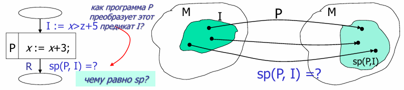

程序P如何把谓词I变为谓词R？

定义：程序P的最强后置条件（strongest postcondition, sp）就是一个谓词，它描述了所有可能的**终止状态**，这些状态由程序 P 从满足初始条件 I 的初始状态转换而来。
强后置条件只取决于程序 P 和初始条件 I，与后条件R无关。

对于上图中 I := x > z + 5 的例子：
程序结束之后，所有 x 的值都自增3，所以如果 I := x > z + 5 满足，那么 sp(P, I) = x > z + 8

> 部分正确性定理

如果存在程序P和3个谓词：
I - 前条件，程序在运行前应该满足的条件
R - 后条件，程序结束后的期望满足条件
<span style="color: #B51515">sp(P, I) - 最强后条件，他描述了所有可能的 终止状态 ，这些状态由程序 P 从满足初始条件 I 的初始状态转换而来。</span>
那么这条定理成立：**如果 sp(P, I) => R，则 { I } P { R }。**

证明略。

> 如何证明程序P的正确性？

步骤：
1. 找到最强后条件 sp(P, I)
2. 检查 sp(P, I) => R 是否成立

由此我们可以得出：

- `{False} P {ψ}` - 如果前置条件是 False，那么对于任何程序 P，它的后置条件都是成立的
  
    这是一个永真三元组，因为前置条件是 False，意味着程序 P 永远不会被执行，所以任何后置条件都无所谓，所以这个三元组在任何情况下都是成立的
    
- `{φ} P {True}` - 对于任何程序 P 和任意的前置条件 φ，当程序 P 执行完毕后，后置条件“True”总是成立
  
    这个三元组也是永真的，因为后置条件是 True，表示任何结束状态都是符合的。因此，**无论前置条件或程序的具体形式如何**，后置条件为“真”总是成立的

> 如何求取程序的最强后条件 sp(P, I)?

需要根据程序的复杂程度分情况讨论：
- 赋值语句
- 顺序结构
- 分支结构
- 循环结构

#### (1) 赋值语句
- 形式：x := e
- 规则：
	- 将初始条件 I 中的变量x替换成表达式 e
- 计算方法：
	- `sp(x:=e,I)=I[x↦e]`
	- 其中`I[x↦e]`表示将 I 中所有出现 x 的地方替换成 e

- 例子：
```
{x > 0}
x := x + 1
```

- 初始条件：I: x > 0
- 赋值后 sp(x:= x + 1, x > 0) = x - 1 > 0
- 化简得 sp = x > 1

计算步骤（我个人的理解）：
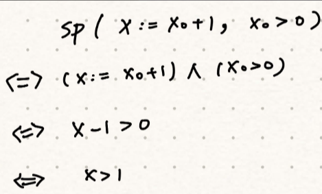

判断程序是否满足部分正确性的例子：
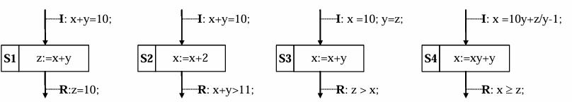

我的求解过程：
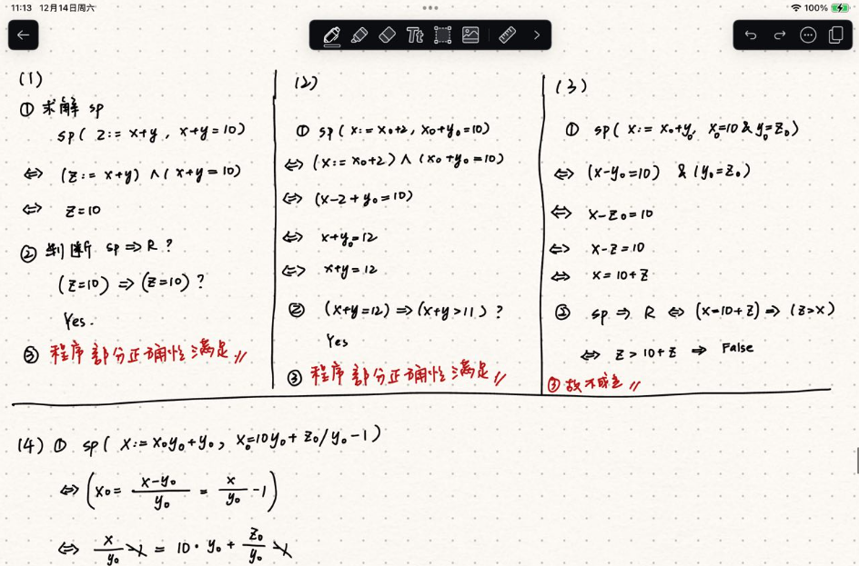

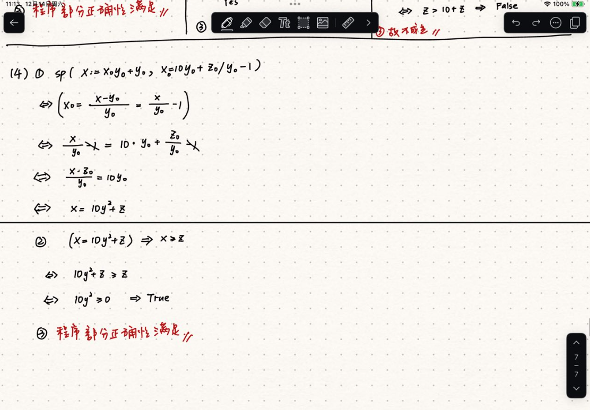

答案：（见PPT[[Модуль 2. Дедуктивная верификация.pdf) p32）

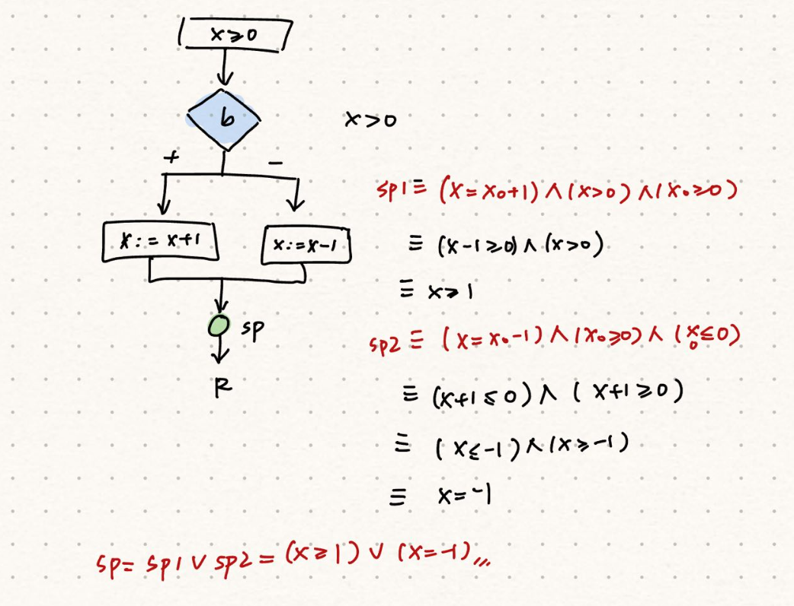


#### (2) 顺序结构
- 形式：P1; P2 （两个程序顺序执行）
- 规则：
	- 先计算第一个子程序的最强后置条件 sp(P1, I)
	- 将其作为第二个子程序的前条件
	- 最终得到的结果是整个顺序结构的最强后条件
- 计算方法：
	- `sp(P1​;P2​, I) = sp(P2​, sp(P1​,I))`

示例：
```
I = {y + x > z + 1}
x := 2z + x;
y := y - x;
```

我的求解步骤：
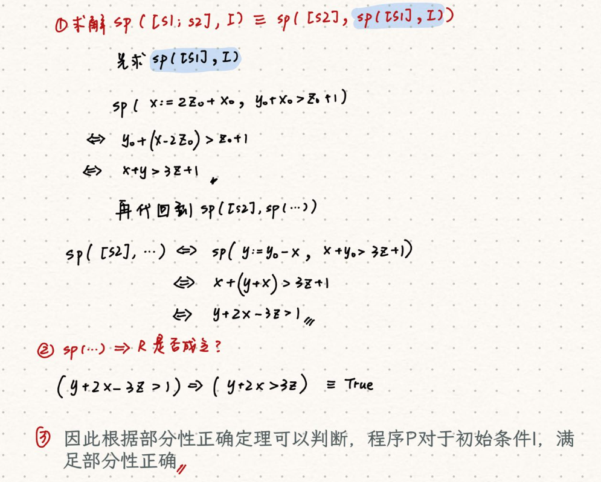

答案：（见PPT[[Модуль 2. Дедуктивная верификация.pdf) p37）
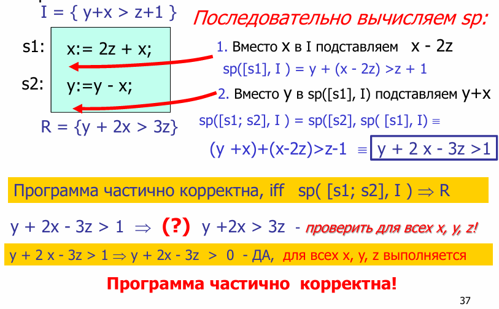

如果程序由多个子程序组成：`[s1; s2; s3; s4; s5]`
那么：`sp([s1; s2; s3; s4; s5], I) `
`=== sp(s5, sp([s1; s2; s3; s4]))` 
`=== sp(s5, sp([s4], [s1; s2; s3])))` 
`=== ... `
`=== sp(s5, sp([s4], sp([s3], sp([s2], sp([s1], I)))))`

用自底向上的方法，先求最里面的`sp([s1], I)`，再求`sp([s2], ...)`，再求 `sp([s3], ...)`，再求 `sp([s4], ...)`，最后求 `sp([s5], ...)`。


#### (3) 分支结构
- 形式：if C then P1 else P2
- 规则：
	- 计算分支条件成立时的最强后置条件 `sp(P1, I ∩ C)`
	- 计算分支条件不成立时的最强后置条件 `sp(P2, I ∩ not C)`
	- 将两个结果的析取作为整个分支结构的最强后置条件
- 计算方法：
	- `sp(if C then P1 else P2， I) = sp(P1, I ∩ C) ∪ sp(P2, I ∩ not C)`
- PPT 中的位置：
	- 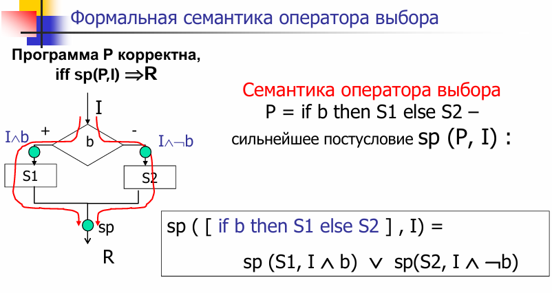
- 例子：计算这个程序的最强后置条件
```I = {x >=0}
P = if x > 0
	then x := x + 1
	else x := x - 1
```


#### (4) 循环结构
- 形式：while C do P
- 规则：
	- 循环结构的最强后置条件需要依赖循环不变式 $I_{inv}$ (инвариант)
		- *инвариант цикла - утверждение, которое остается истинным при всех прохождениях цикла*
	- 循环终止时的条件为 $\neg C$，因此终止状态应满足 $I_{inv}​ ∧ ¬C$
- 计算方法
	- 定义循环不变式 $I_{inv}$，确保 `sp(P, I_inv) => I_inv`
	- 最强后置条件为：$$sp(while\ C\ do\ P,\ I)=I_{inv}​∧¬C$$
- PPT中的表述：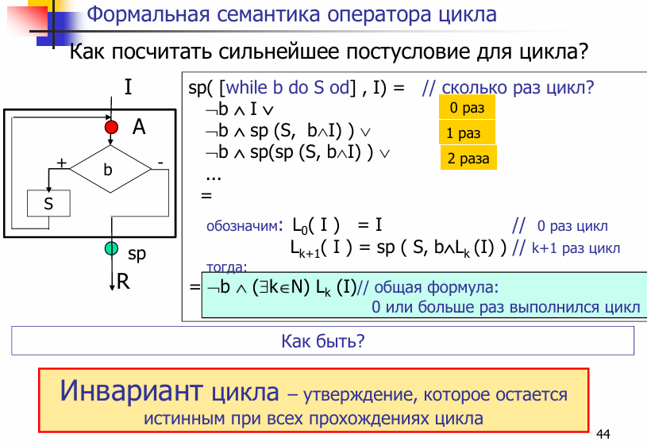
- 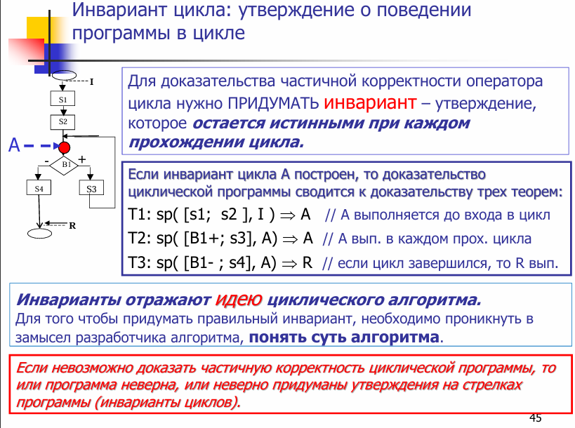
	- 如果构造了循环不变量 A，则循环程序的证明就简化为三个定理的证明：
		- `Т1: sp( [s1; s2 ], I ) => A`
		- `Т2: sp( [B1+; s3], A) => A`
		- `Т3: sp( [B1- ; s4], A) => R`
	- 如果无法证明循环程序的部分正确性，那么要么该程序不正确，要么程序箭头上的语句（循环不变量）被错误地编写。

示例：证明一个阶乘程序的正确性

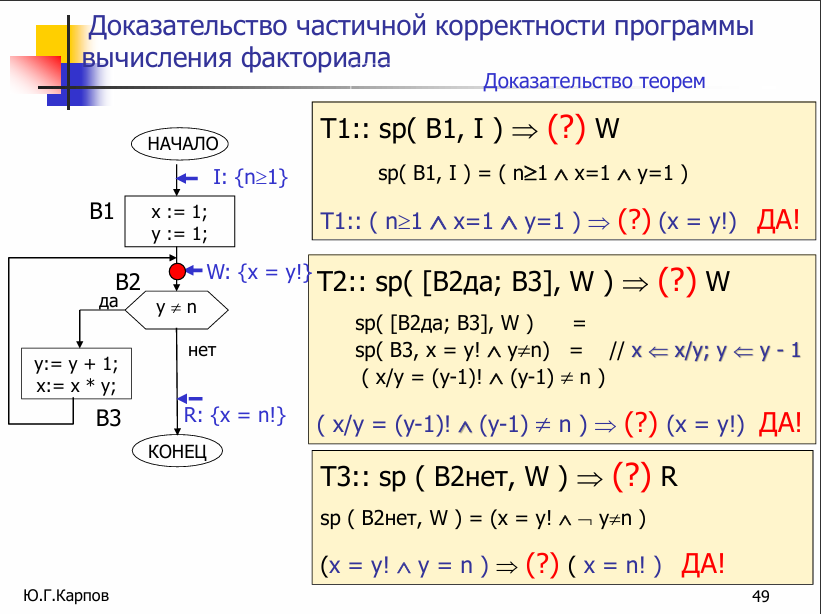


我的求解过程：
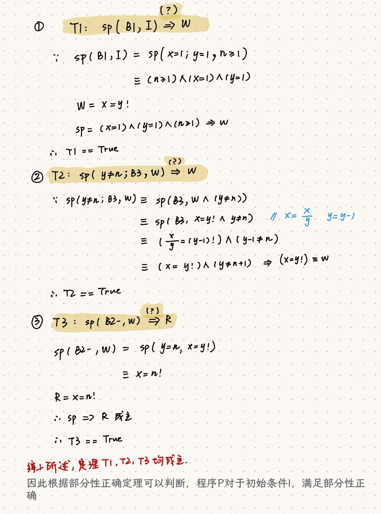

##### 这里的难题在于，循环不变式怎么找？

循环不变式的定义：

循环不变式（Loop Invariant）**是指在循环开始前、循环每次迭代时以及循环结束后，始终保持为真的某个条件或谓词。** 它用来帮助证明程序的正确性，尤其是证明程序在完成时是否满足后置条件。

循环不变式的找法：

找循环不变式通常遵循以下步骤：

1. **分析程序的目标：**
   
    - 确定程序的功能和目标是什么，比如计算阶乘、排序数组等。
2. **理解程序的状态变化：**
   
    - 观察程序中的变量在每次循环迭代时如何变化。
    - 需要找出一个条件，它在每次迭代后都为真，并且帮助描述程序的目标。
3. **验证初始条件和循环终止条件：**
   
    - 循环不变式应当在初始时成立，并且在每次循环执行后依然成立。
    - 循环退出时，不变式应有助于证明程序满足后置条件。
4. **使用归纳法：**
   
    - 通过归纳法来验证：假设不变式在某次迭代中成立，证明在下一次迭代中依然成立。


---

求解抛物线移动之后的图像，原理是求解程序的最强后置条件。【小测原题】

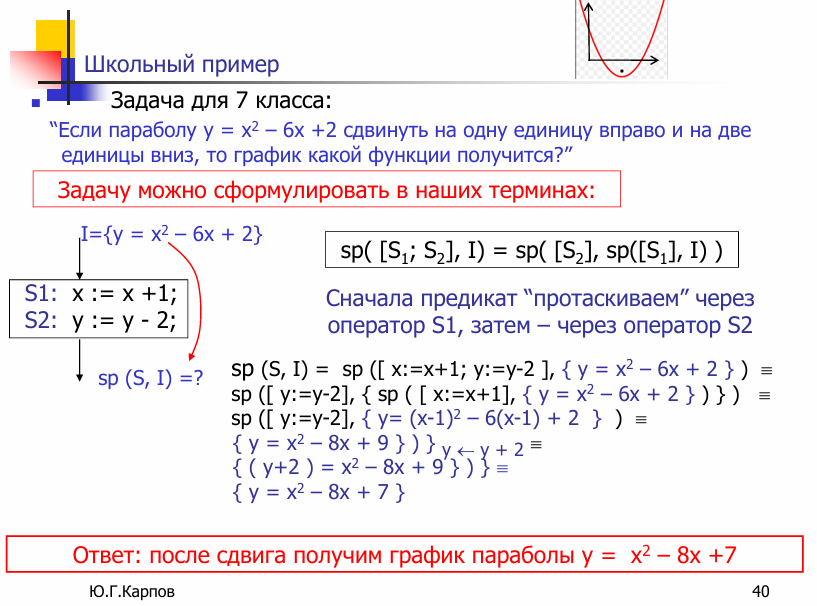

在移动之前满足抛物线 `I = { y = x^2 - 6x + 2 }`，经过移动(程序) 之后会得到怎样的图像？
这个问题等价于，求解程序的最强后置条件。


---

{ I } S { R } – утверждение : “ Если состояние программы S завершается, то после завершения состояние S удовлетворяет постусловию R “

### wp (最弱前置条件)

wp(S,R) - максимально широкое предусловие, такое, что из любого состояния, удовлетворяющего wp(S,R), после завершения программы S состояние S будет удовлетворять R

**Определение.** Слабейшее предусловие wp(S, R) программы S задает множество ВСЕХ тех состояний S, из которых в результате выполнения S попадем в те состояния, которые удовлетворяют предикату R

**wp(P, Q)** 是程序 P 执行之前需要满足的最弱条件，使得程序 P 在执行后能够保证满足后置条件 Q。

简而言之：

- wp(P,Q) 是所有能够确保程序 P 执行完后满足 Q 的前置条件中最弱的一个。
- "最弱" 表示：它包含所有更强的前置条件（即满足 wp 的条件也满足所有更强的条件）。

例子：
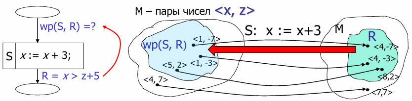

w(S, R) = (x + 3) > z + 5

定理：`{ I } S { R }` 成立当且仅当 `I => wp(S, R)`

> 怎样求 wp？

#### 如何求程序的最弱前置条件 wp(S,R)wp(S, R)

根据 **PPT 3: Модуль 3. Темпоральные логики** 提供的方法，对于一个程序 SS，给定前条件 II 和后条件 RR，求解最弱前置条件 wp(S,R)wp(S, R) 可以分不同的程序结构讨论。

##### (1) 赋值语句
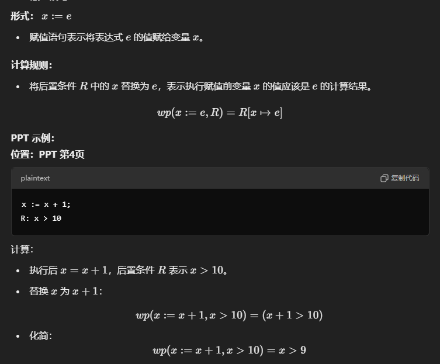

##### (2) 顺序结构
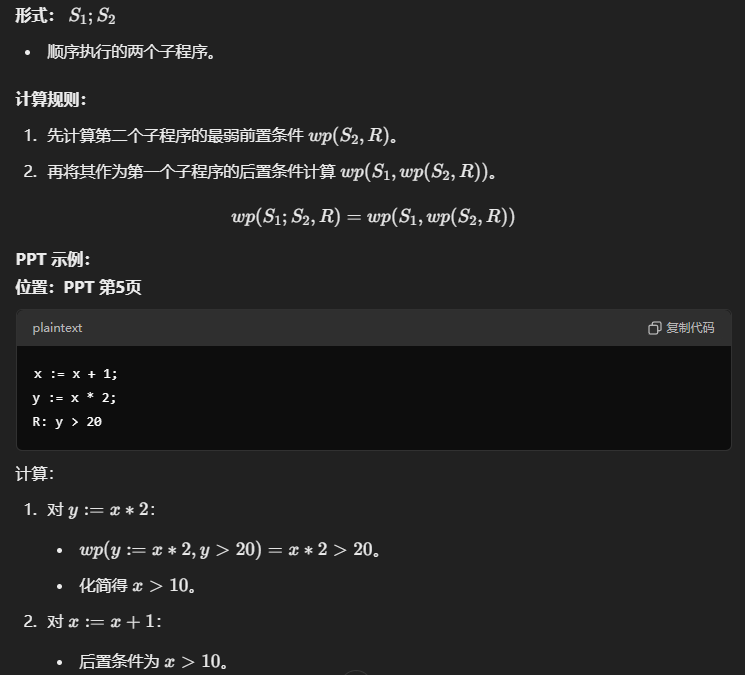


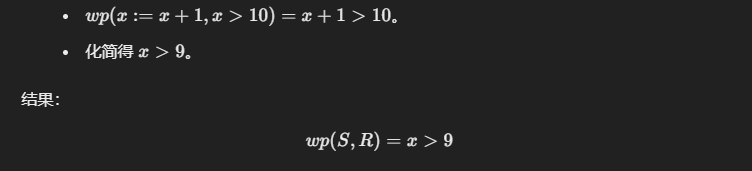


##### (3) 条件分支
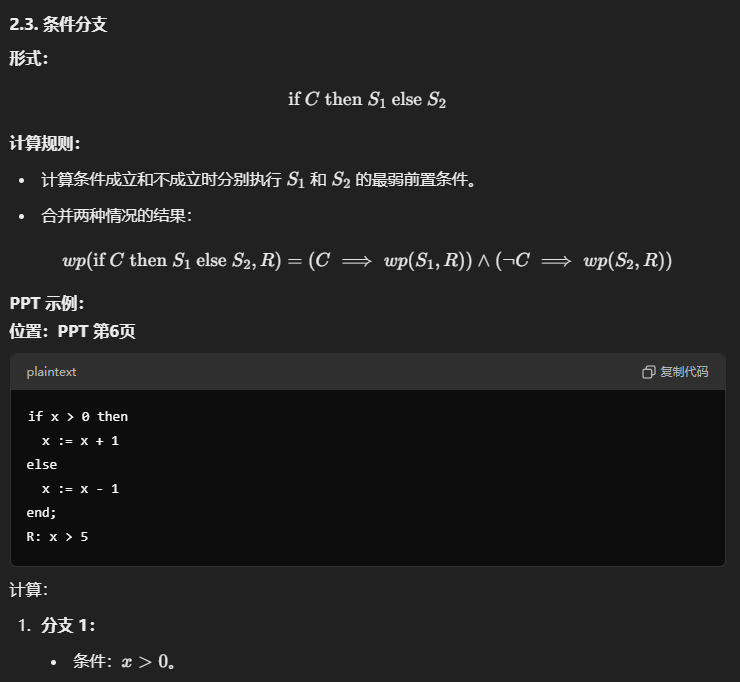


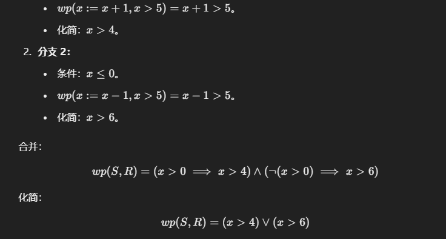


##### (4) 循环结构
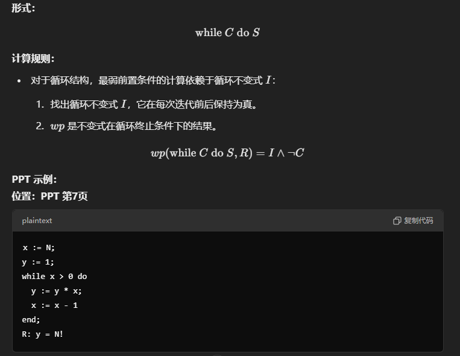


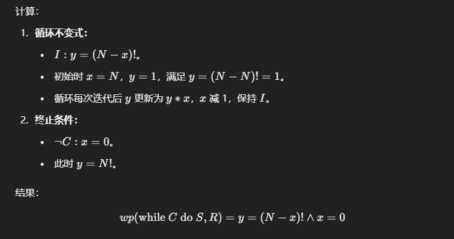

总结
1. **赋值语句：** 用目标变量的表达式替换后置条件。
2. **顺序结构：** 递归计算子程序的 wpwpwp。
3. **条件分支：** 分别计算分支条件下的 wpwpwp 并合并。
4. **循环结构：** 利用循环不变式计算终止条件下的 wpwpwp。

---

> 时态逻辑

- 时序逻辑是一种扩展的逻辑形式，用于描述系统的时间行为。
- 它允许表达系统状态随时间的变化，例如某个属性在未来是否成立。
- **LTL（线性时序逻辑）：** 表达“在未来某时刻某事件必然发生”。
- **CTL（分支时序逻辑）：** 表达“从当前状态出发，有一个路径满足某条件”。
- 应用场景：常用语验证交互式系统
	- 验证系统的安全性（Safety）。
    - 验证系统的活性（Liveness）。


## Структура Крипке (Kripke 结构)

定义：Kripke 结构是描述系统状态及其状态间转移的数学模型，用于形式化验证和时序逻辑公式的语义解释。它是时序逻辑（如 LTL 和 CTL）的基础。

时序逻辑传统上是由克里普克结构进行解释的。

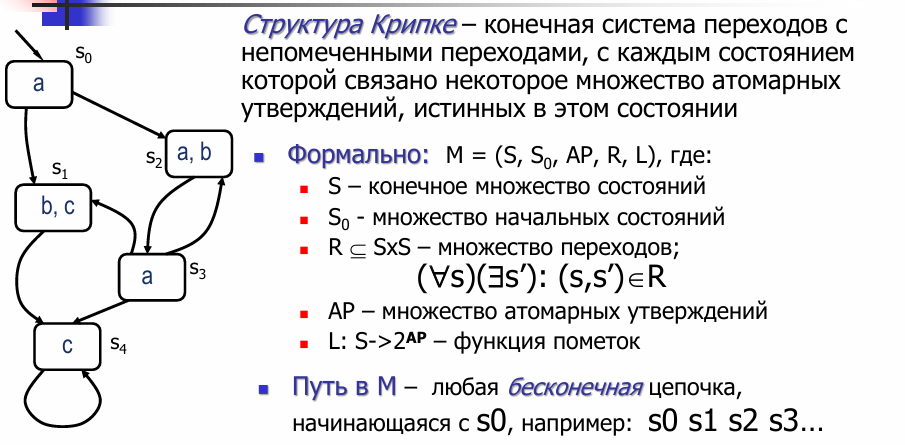

Kripke 结构由以下三部分组成：
1. 状态集合S，其中初始状态集合S0是S的子集
2. 转移关系集合 R：描述状态间可能的转移。
3. 原子命题集合 AP：系统中的原子命题集合。
4. 标签函数 L：L(s) 表示在状态 s 下为真的命题。

#### Kripke 结构的图形表示

在 Kripke 结构中：

- **状态**：用圆圈表示（如 s0,s1,s2​）。
- **转移关系**：用有向边连接状态（如 s0→s1​）。
- **标签**：标注在状态内的原子命题（如 p,q）。


## 时态逻辑（Tense Logic, TL）

> Модальность 模态，modus

Модальная логика - любая формальная логическая система, в которой присутствуют модальные операторы. 
模态逻辑是其中存在*模态运算符*的任何形式逻辑系统。

Примеры модальных операторов：模态运算符
- Mp：“возможно, что р истинно“ p可能为真
- Lp：“р обязательно истинно” p必然为真
- Fp：“когда-нибудь в будущем р будет истинным” 在未来p将会为真
- Gp：“р будет истинным всегда в будущем” p在未来永远为真
- $K_Ap$： “агент А знает, что р истинно” 代理人知道p为真
- $B_Ap$：“агент А считает (полагает), что р истинно” 代理人相信p为真

时态逻辑是模态逻辑中的一种。

### 线性时序逻辑（LTL）
LTL 的逻辑公式描述系统在**线性时间**上的行为。
常用操作符：
- **X (Next)：** 下一个状态
- **F (Eventually)：** 未来某个状态
- **G (Globally)：** 所有未来状态
- **U (Until)：** 直到

LTL 是一种形式语言。形式语言有语义和语法。
我们先说语法：
LTL公式 φ 是指：
- 原子语句 p, q ... 
-  [逻辑运算符](https://zh.wikipedia.org/wiki/%E9%80%BB%E8%BE%91%E8%BF%90%E7%AE%97%E7%AC%A6 "逻辑运算符")：[非](https://zh.wikipedia.org/wiki/%E9%80%BB%E8%BE%91%E9%9D%9E "逻辑非")（¬）、[与](https://zh.wikipedia.org/wiki/%E9%80%BB%E8%BE%91%E5%90%88%E5%8F%96 "逻辑合取")（∧）、[或](https://zh.wikipedia.org/wiki/%E9%80%BB%E8%BE%91%E6%9E%90%E5%8F%96 "逻辑析取")（∨）、[条件](https://zh.wikipedia.org/wiki/%E5%AE%9E%E8%B4%A8%E6%9D%A1%E4%BB%B6 "实质条件")（→）
- 时态运算符：**X**，**F**，**G**，**U**，**R**等
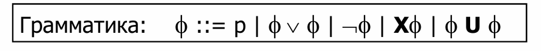

其他时态运算符：


总之：
- LTL 有4个模态运算符：F, G, U, X
- F, G 通过 U 来表示：
	- $Fp \ \equiv true\ U\ p$
	- $Gp \ \equiv \ \neg F \ \neg p$

语义上，每个时态运算符 X, F, G, U, R, W, M 都有对应的含义：
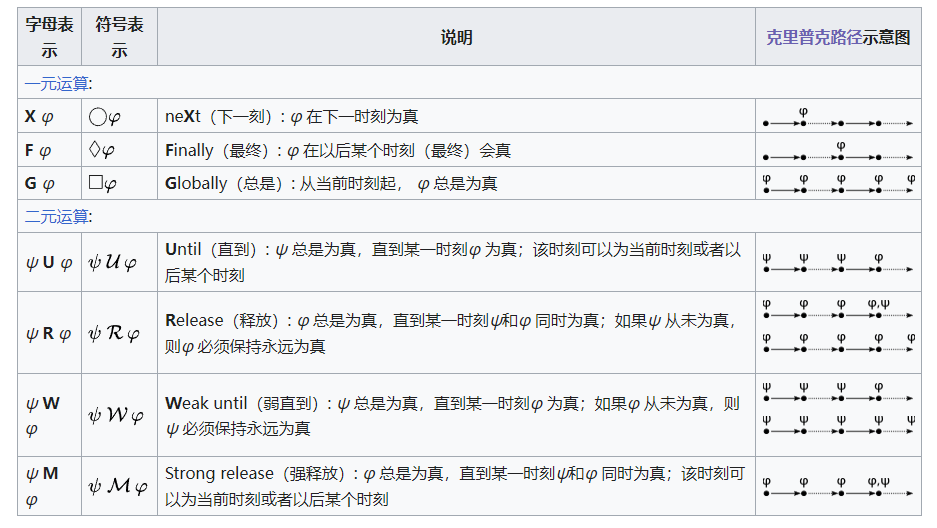

*R, W, M 在课程中似乎暂时没有涉及*

- `X p`：在下一个状态，`p` 为真。
- `F p`：在未来的某个状态，`p` 为真。
- `G p`: 在所有未来状态，`p` 为真。
- `p U q`： `p` 一直为真，直到 `q` 为真。


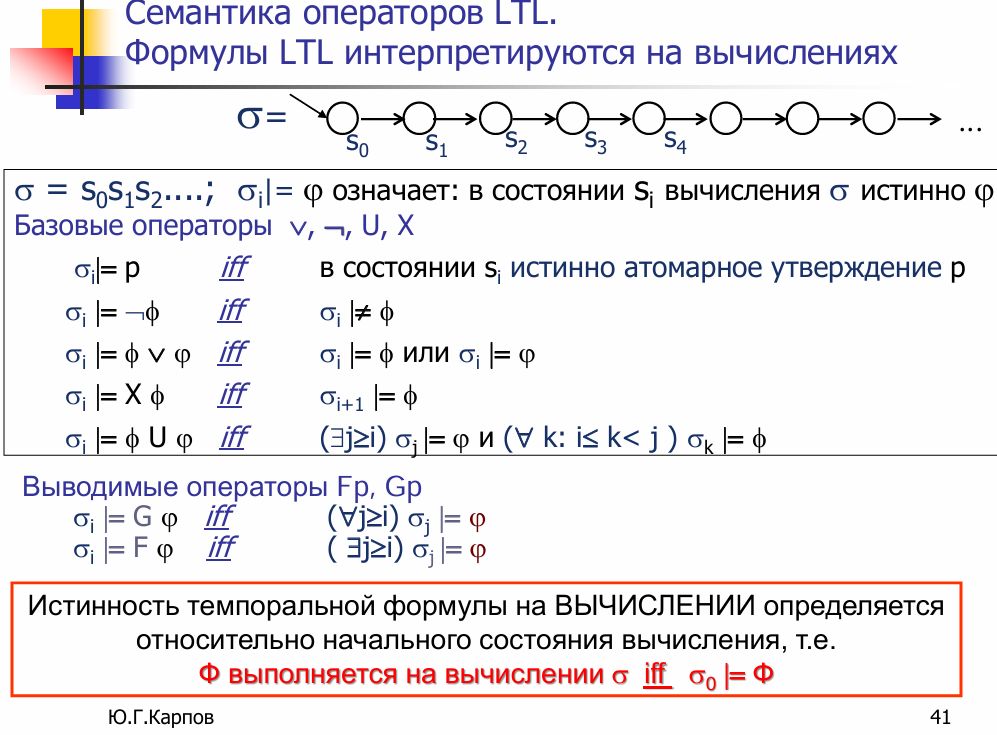

解释：对于一条路 σ，定义σ 满足公式p为 `σ |= p`。归纳如下：

1. σi |= p：在状态si的时候语句p为真
2. σi |= ¬p：在状态si的时候语句p为假
3. σi |= p ∨ q：在状态si的时候，p ∨ q 为真
4. σi |= X p：在si的下一个状态(si+1) p为真
5. σi |= p U q：在si之前, p 一直为真，从si开始(包括si) q一直为真
6. σi |= G p：从si开始(包括si) p一直为真
7. σi |= F p：从si开始(包括si) 至少存在一个 p 为真的状态

离散系统的 LTL 公式： [[Модуль 3. Темпоральные логики.pdf)
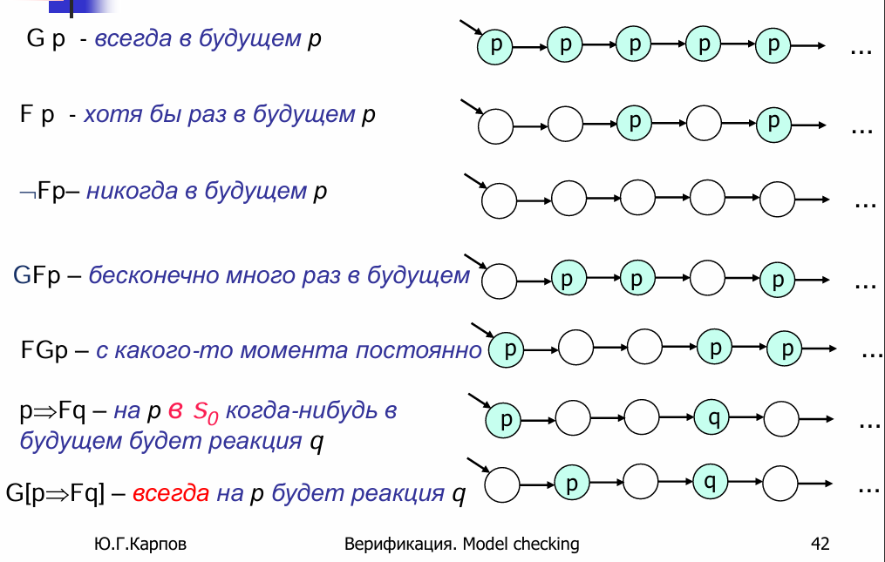

解释：
- Gp：p 始终为真。
- Fp：p 至少未来某时刻为真。
- ¬Fp：p 永远不为真。
- GFp：p 无限多次为真。
- FGp：从某时刻起，p 始终为真。
- p⇒Fq：p 为真时，未来某时刻 q 为真。
- `G[p ⇒ Fq]`：始终，当 p 为真时，未来必定会有某时刻 q 为真。

F 和 G 之间的关系：
Fp = ¬G¬p
Gp = ¬F¬p
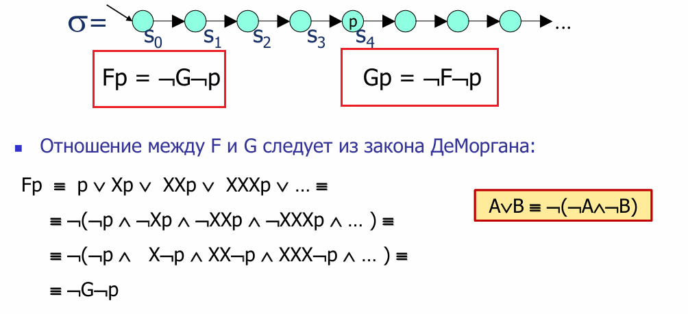

> Kripke 结构的运算

Kripke 结构是无限循环的。要怎么用有限的方式计算？
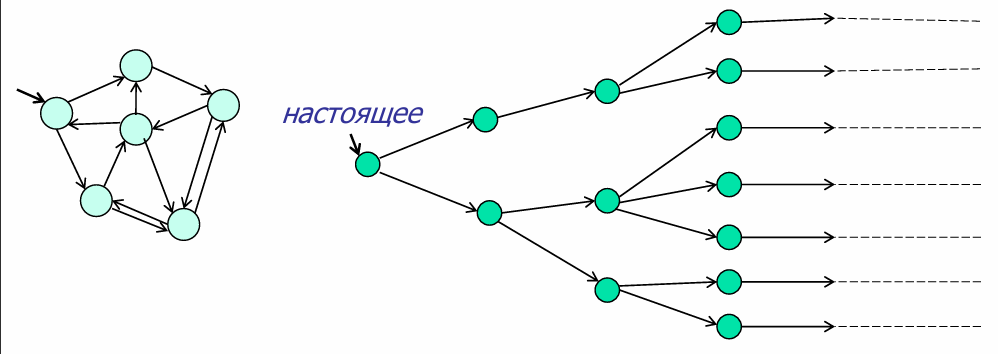

Развертка структуры Крипке может быть использована как модель ветвящегося времени 
Kripke 结构可以展开成分支时间模型。

**分支时间模型** 就是将 Kripke 结构的状态和转移关系展开，形成树状结构，称为 **状态空间展开**（State Space Unfolding）。

> Развертка структуры Крипке Kripke 结构的展开

分支时间模型对应的是 **CTL（分支时序逻辑）**，它的核心特征是：

- 可以在多条路径上检查命题是否成立。
- CTL 公式使用 **路径量词** 和 **时序操作符** 来描述分支时间的性质：
    - **路径量词：**
        - A（For All）：所有路径上。
        - E（Exists）：存在至少一条路径。
    - **时序操作符：**
        - X：下一个状态。
        - F：未来某个时刻。
        - G：所有时刻。
        - U：直到某个条件满足。

例如：
- AG(p)：在所有路径上，所有未来状态都满足 P。
- EF(q)：存在至少一条路径，在未来某个时刻满足 q。


### CTL 
- **定义：** CTL 是一种分支时序逻辑，用于描述树状时间模型中的状态和路径的属性。
- **特点：**
    - 每个时序操作符必须带有**路径量词**（A 表示所有路径，E 表示存在路径）。
    - 路径量词和时序操作符不能分离，必须成对出现。
- **公式结构：**
    - CTL 公式的基本形式：**路径量词 + 时序操作符**。
    - 示例：`AXp, EFq, AGp, E[pUq]`

### CTL*

> CTL* // Темпоральные логики ветвящегося времени // Computational Tree Logic

CTL* 公式描述**计算树（Computation Tree）** 的性质，计算树由 Kripke 结构生成。首先在 Kripke 结构中指定一个状态为初始状态，接着将这个结构展开成以此状态作为根的无限树。**计算树展示了从初始状态开始的所有可能的执行路径。**

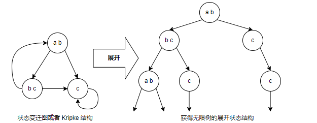

> CTL 和 CTL* 的区别

- **定义：** CTL* 是 CTL 和 LTL（线性时序逻辑）的统一扩展，允许更复杂的组合表达。
- **特点：**
    - CTL* 的路径量词（AAA、EEE）和时序操作符（X,F,G,UX, F, G, UX,F,G,U）可以分离，可以灵活地组合。
    - CTL* 允许在路径上编写任意的 LTL 公式，同时也支持分支逻辑的表达能力。
- **公式结构：**
    - CTL* 公式的基本形式：**路径量词 + LTL 公式**。
    - 示例：`A(GFp), E(G(p∨Fq)), G(Fp)`

| **特性**       | **CTL**                                | **CTL***               |
| ------------ | -------------------------------------- | ---------------------- |
| **路径量词与操作符** | 必须成对出现（例如：AX,EF,AGAX, EF, AGAX,EF,AG）。 | 可以分离，路径量词与 LTL 公式自由组合。 |
| **公式的表达能力**  | 更受限制，公式较为简单。                           | 更强大，支持嵌套和任意组合的公式。      |
| **示例**       | AG(p→AFq)                              | G(Fp∨A(Gq))            |

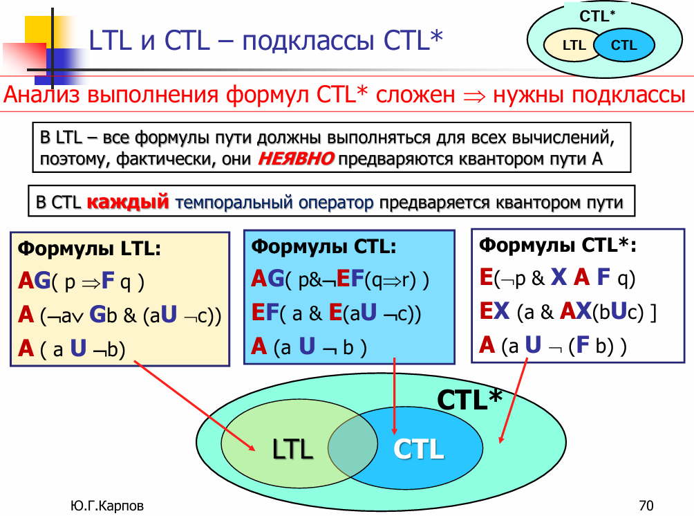
可以认为 `CTL` 是 `CTL*` 的子集


> `CTL*` 允许的运算符

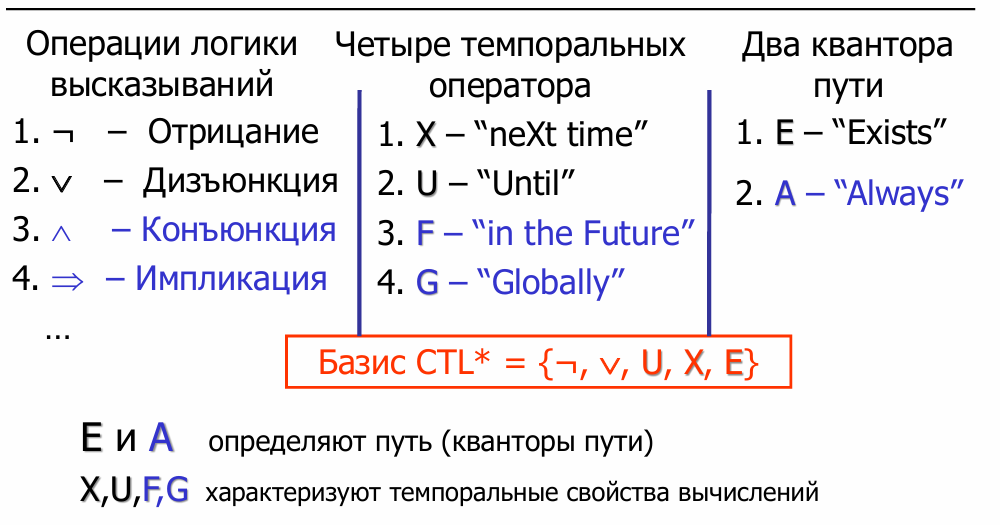

> Семантика CTL* на структурах Крипке // CTL* 的语法

> `CTL*` 状态公式语法
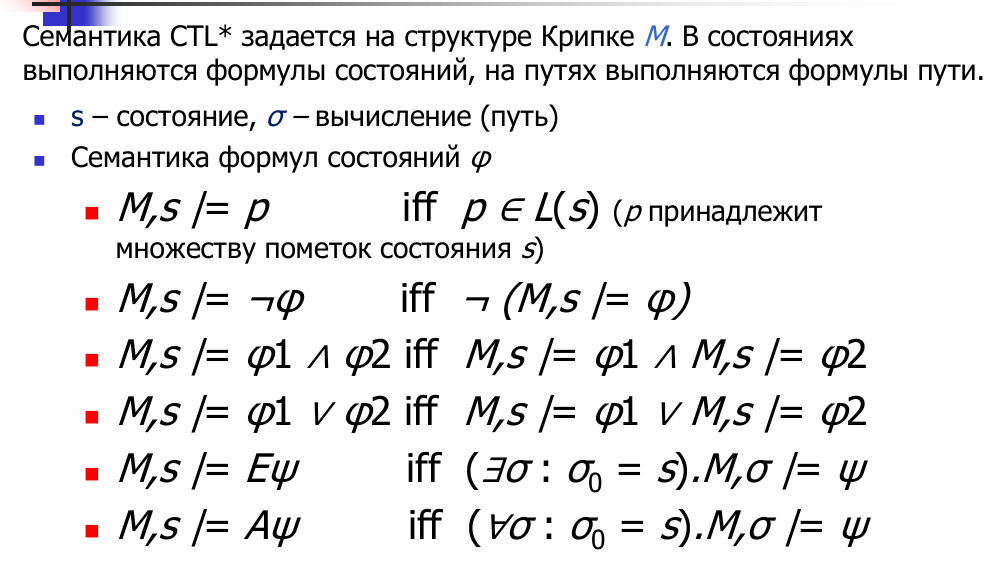

- M, s |= p ： p 在 s状态下为真
- M, s |= ¬p： p 在 s状态下为假
- M, s |= p ∨ q： 在s状态下，q或p为真
- M, s |= Ep：从状态s开始(包含s)，存在一条路径(时刻)使得p满足
- M, s |= Ap：从状态s开始(包含s)，所有路径(时刻)都满足p

> `CTL*` 路径公式语法
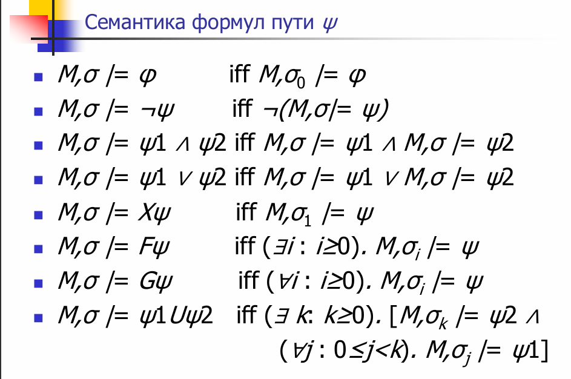

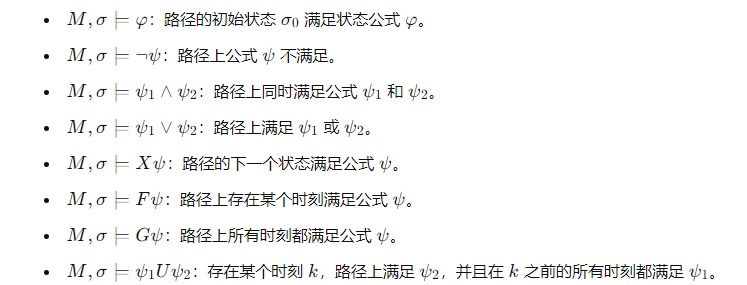

---

### CTL
В CTL каждый темпоральныйоператор предварен квантором пути. ВСЕ ФОРМУЛЫ CTL –формулы СОСТОЯНИЙ. 
在 CTL 中，每个时间运算符前面都有一个路径量词。
 所有 CTL 公式都是 状态 公式。

> CTL 语法

共有4个运算符 **X, F, G, U**，2个路径量词 **E, A**。组合使用，所以一共有 8 个 CTL 操作符：
AX, EX,
AF, EF,
AG, EG,
AU, EU

合法公式：`E[cUb], A[pU(rEFq)], EXpEXq, EGАFp, ...`

CTL 不合法的公式有：`EGFp, A[ Xp∨ XXr], …`

非形式化的 CTL 公式定义：
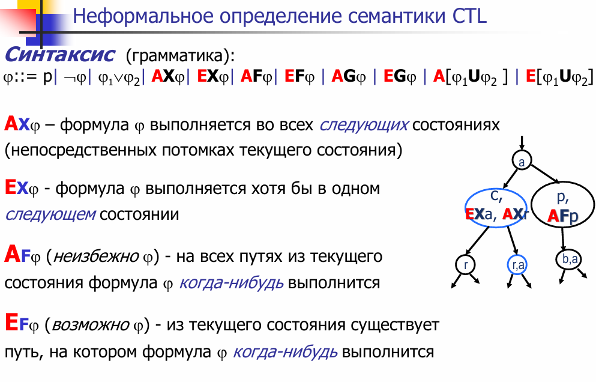

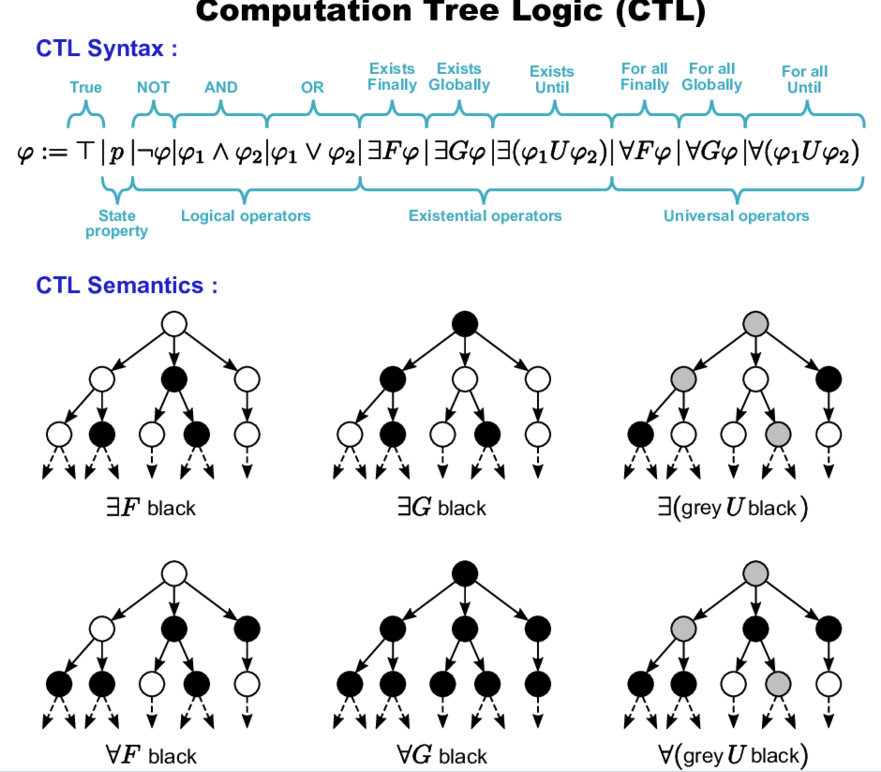

其他表示方法：

在模型验证中，表达式 M,s⊨Aψ 表示在模型 M 的状态 s 下，“**总是**”满足公式 ψ，也就是说，沿着从 s 出发的 **所有路径（A，代表 All）**，公式 ψ 都成立。

具体解释如下：

- **M**：这是一个 Kripke 结构（或状态转换系统），用来表示模型的所有状态及其状态间的转移关系
- **s**：模型 M 中的**一个特定状态**
- **A**：这是 CTL（计算树逻辑）中的路径量词 “所有（All）”。它表示从当前状态出发的所有可能路径。
- **ψ**：这是一个逻辑公式，可以描述状态的某种性质或一系列性质

因此，整个公式 M,s⊨Aψ 表示：

在模型 M 的状态 s 中，沿着所有可能的路径，公式 ψ 都成立。换句话说，从状态 s 出发，不管未来的路径怎么发展，公式 ψ 在每条路径上都是成立的

> CTL 公式例子

- `AG p`: 在所有路径上的所有状态中，`p` 都为真（`p` 在所有未来都成立）。
- `EF p`: 存在一条路径，在该路径的某个未来状态，`p` 为真（`p` 在某个未来状态成立）。

CTL 的一个关键特性是它的表达力不仅考虑了单一未来的线性时间，还能够表达不同路径的分支未来。例如，“所有可能的未来中某个状态必须满足条件”是 CTL 能表达的一个经典性质。


---

## Алгоритм Model checking для проверки выполнимости формул CTL

Наша задача – рассмотреть алгоритм Model checking для логики CTL

目标：验证 **CTL（分支时序逻辑）** 公式在 **Kripke 结构** M 上的可满足性。
**任务：** 确定给定的 Kripke 结构 M=(S,R,L) 和状态 s0​ 是否满足公式 φ\，即：


CTL 公式的特点：
- 路径量词：A, E
- 时序操作词：X, F, G, U
- CTL 公式必须满足路径两次与时序操作符配对的规则，比如
	- AXp, EFq, AGp, `E[pUq]`

==方法：基于 Kripke 结构的验证方法==【<span style="color: #B51515">必考！Exam 第一题！</span>】

形式化表达问题：

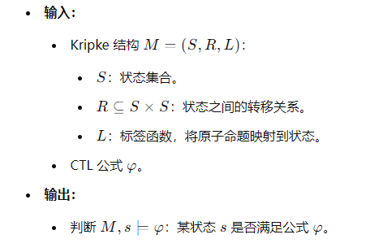

 *"Необходимо разработать алгоритм проверки выполнимости произвольной темпоральной формулы на любой структуре Крипке."*

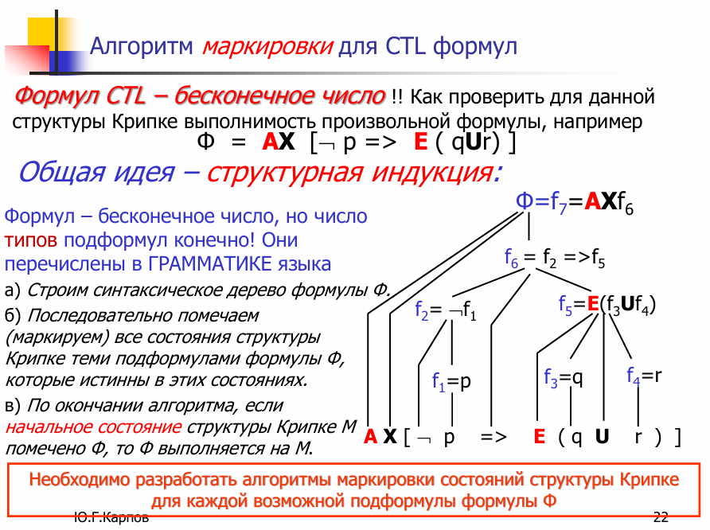

*Общая идея – структурная индукци*
*总体思想是结构归纳法*

*Формул – бесконечное число, но число типов подформул конечно! Они перечислены в ГРАММАТИКЕ языка*
*公式有无限多个，但子公式的类型数量是有限的！它们列在该语言的语法中*

步骤：
1. 为公式F构建语法树
2. 我们依次用在这些状态下为真的公式 Φ 的子公式来标记（标记）克里普克结构的所有状态。
3. 在算法结束时，如果Kripke结构M的<span style="color: #B51515">初始状态</span>标记为Φ，则在M上能满足公式Φ。

CTL 之间的相互关系：

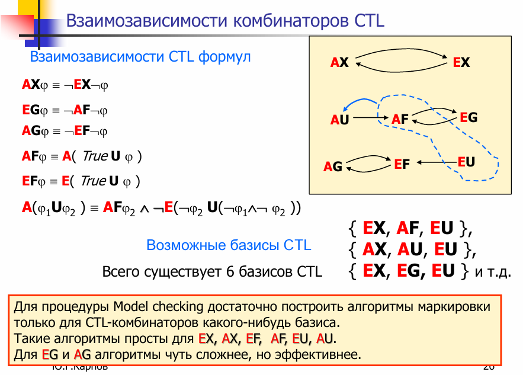

Базисы CTL
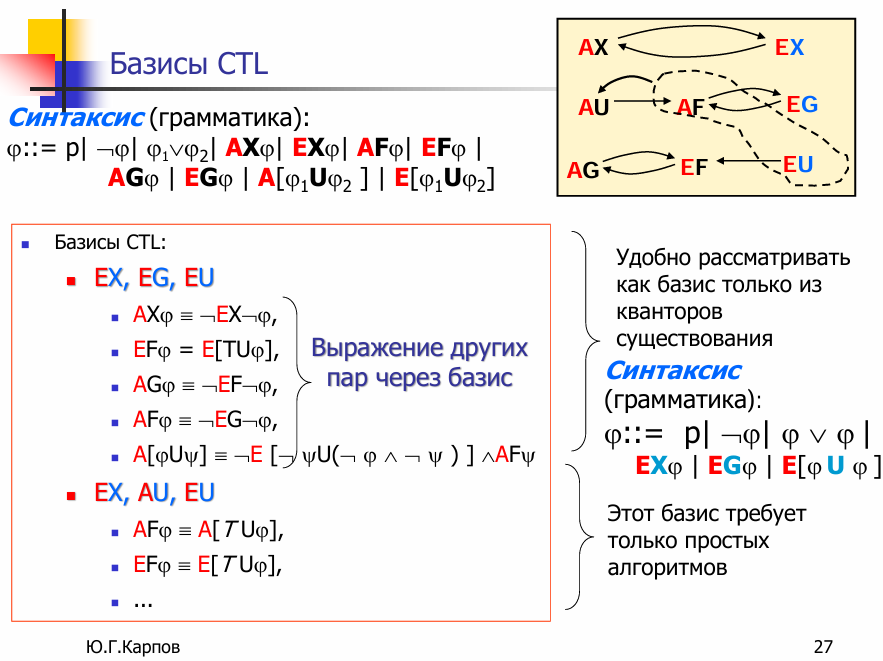


#tbd_verification: Модуль 4. MC для LTL_1，p34页 中有一个例子：

现有一个CTL公式：`Ф = E [EX not p U AF (q ∩ r) ]`
和一个模型（自动机）：

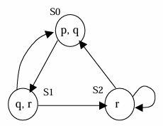

检查在模型的哪些状态下满足公式`Ф`？
先说结论，再说实操。结论是递归分解成最小的CTL公式，然后自底向上检查每个状态满足哪些CTL公式。最后的关键是看公式 `Ф` 是否落在 s0上。如果落在了 s0 则说明模型能完成 `Ф` 公式。

以这个例子探讨一下这类题型的做法：实操三步走。

1）公式转化成语法树：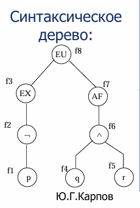

2）列出语法树中所有出现的公式：
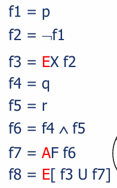

3）从f1开始到fn(`Ф`)，检查自动机的每个状态可以满足哪些公式：
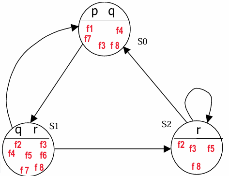

4）最后可以得出结论，在模型的s0, s1, s2状态下都满足公式 f8（`Ф`）


*Для заданных структуре Крипке и формулы Ф логики CTL нужно уметь строить множества состояний, в которых выполняется формула Ф (и все ее подформулы).*

 *Это является стандартным умением, которое будет проверяться у каждого студента.* 


---

## Model checking для формул LTL


---

# 题型总结

## 🐟弗洛伊德法

### 判断程序的正确性
Вар1, 1
Вар7, 2


## 🐟Крипке + CTL

### 给定 Крипке M 和 一个 CTL 公式，判定在哪些状态下公式能满足？（必考）
Вар1, 1


## 🐟LTL

### 把自然语言命题转化成LTL公式
Вар1, 2


### LTL 公式的恒等性
Вар1, 3


### 证明或证伪公式
Вар7, 4


## 🐟Автомат Бюхи


---

# 补充资料

## 经典命题逻辑

我们通过如下规则定义这种真值指派A在什么时候满足特定公式：
- A满足命题变量P [当且仅当](https://zh.wikipedia.org/wiki/%E5%BD%93%E4%B8%94%E4%BB%85%E5%BD%93)A(P) = **真**
- A满足¬ φ当且仅当A不满足φ
- A满足(φ ∧ ψ)当且仅当A满足φ与ψ二者
- A满足(φ ∨ ψ)当且仅当A满足φ和ψ中至少一个
- A满足(φ → ψ)当且仅当并非A满足φ但不满足ψ的情况
- A满足(φ ↔ ψ)当且仅当A满足φ与ψ二者，或则不满足它们中的任何一个


### 逻辑等价
> https://zh.wikipedia.org/wiki/%E9%80%BB%E8%BE%91%E7%AD%89%E4%BB%B7

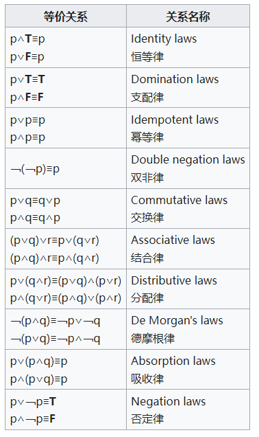

> 包含蕴含的逻辑等价、包含双蕴含的逻辑等价【重要！】


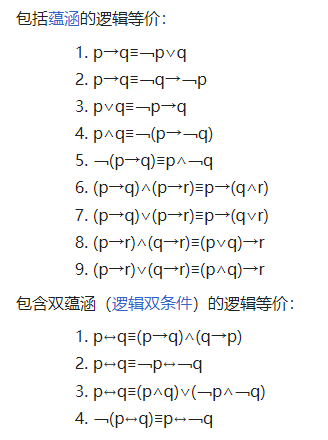


