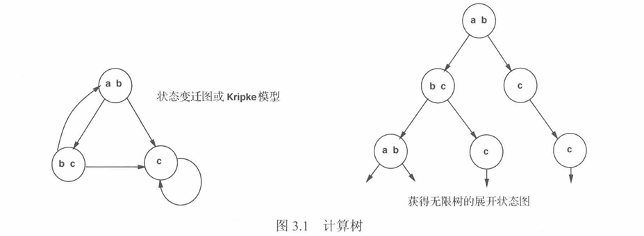
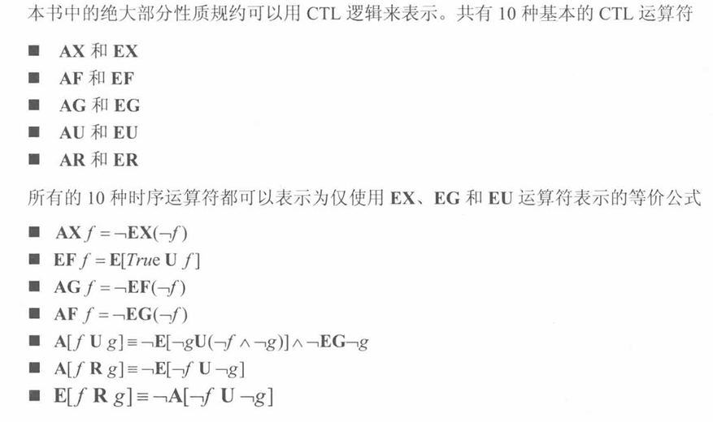
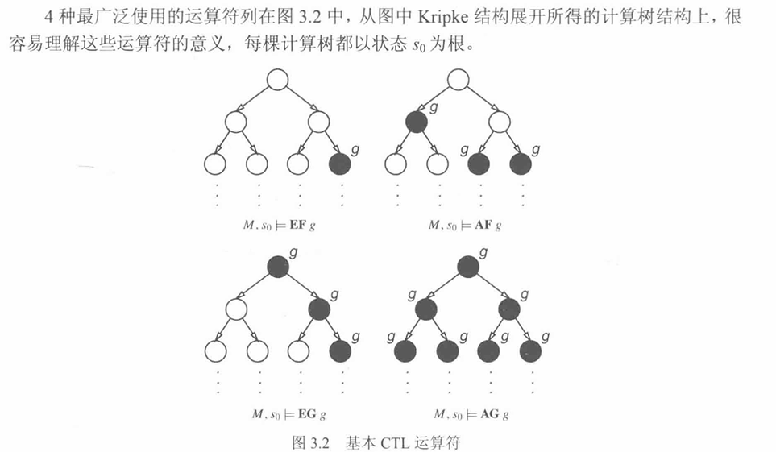
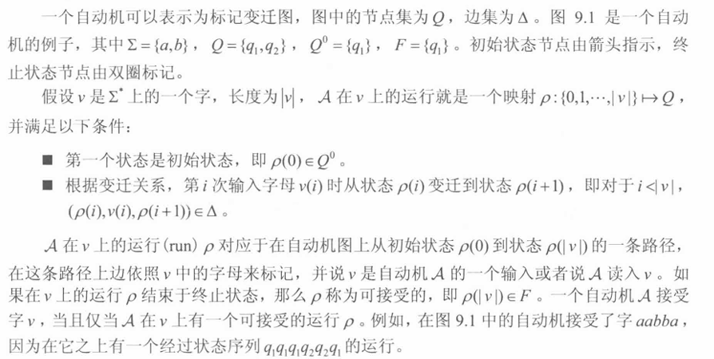

书本信息：

作者：吴尽昭，何安平，高新岩.

书名：模型检测

电子工业出版社，ISBN: 978-7-121-35274-4, 2018

内容简介：模型检测是一种用于自动验证有限状态并发系统的技术，与基于模拟、测试和演绎推理的传统技术相比具有许多方面的优势。本书共分18章，涵盖的主要内容包括 模型检测的基本知识、系统建模、时序逻辑、符号模型检测技术、SMV模型检测器、模型检测与自动机理论、偏序约简、抽象解释、有限状态系统的无限蹙、实时系统验证等。

书本介绍：《Model Checking》可以说是是第一本全面介绍模型检测理论和实践的著作。

---

前 言

计算机科学中的多个领域都涉及有限状态并发系统，特别是数字电路与通信协议与这种系统关系紧密。这些系统研发过程中出现的逻辑错误对于电路设计者和程序员而言，都是一个非常棘手的问题，可能会推退新产品的上市时间，也可能导致一些投入使用的重要设备发生故障。目前广泛使用的验证技术是测试和模拟，但当电路或协议的状态规模巨大时，这些技术无疑会遗漏重要的错误。虽然定理证明器、项重写系统和证明检测器都经过了长期和大量的研究，但是这些技术不但耗时，还常常需要许多人工干预。在20世纪80年代，一个被称为时序逻辑模型检测的验证技术由美国的Clarke与Emersonls以及法国的Quielle与Sifakis 分别独立提出。这种方法使用**命题时序逻辑来表示性质规约**，电路与**协议被建模为状态变迁系统**，并且提出一个用于确定规约是否在变迁系统上为真的高效查找过程，即检测变迁系统是否是性质规约的模型。

同机械化的定理证明或证明检测相比，模型检测在验证电路与通信协议方面有着多个重要的优势，其中最重要的优势是检测过程的全自动化，使用者只需提供被检测的模型与性质规约的高阶描述。**模型检测算法要么以结果为真终止，此时模型满足规约：要么给出一个反例指出性质违反规约的原因。**在复杂变迁系统中，这种反例非常有益于发现和修正细微错误模型检测过程相当快，通常大约几秒钟产生一个结果。在检测过程中，由于可以部分地检测规约，所以在获得有用信息之前不必构建完整的系统模型。当性质规约不能满足时，可以通过精心构建与当前规约不同的公式，来检测并定位错误的源头。除此之外，描述性质规约的逻辑能直接表示许多并发系统推理所需的性质。

**模型检测的主要缺点是状态爆炸**，这种情况发生在由许多系统组件并发演化构成的系统中。在这种情况下，整个系统状态的数目将按组件数量呈指数级增长。由于这个问题，许多形式验证的研究者预言模型检测对于大型系统绝对是不实用的。但是，在20世纪80年代后期，模型检测技术所能检测的变迁系统的规模显著地增大了。

**这种增长归因于高效表示布尔函数的二叉判定图结构的应用**，它不但简洁地表示了变迁系统，也提升了布尔运算的速度。符号模型检测方法对同步电路特别有用。在验证异步协议时，可通过偏序约简技术来减少状态空间的规模。偏序约简的基础是，不同顺序事件对应的计算无法被性质规约区分，可以认为是等价的，因此只需为等价类保留一个典型的计算，检测这种约简空间即可。

基于以上这些技术，以及稍后在本书中介绍的其他一些技术，现在模型检测己经作为一种实用的验证技术在工业界中得到了广泛使用。实际上，几家公司正开始把模型检测工具推向市场。

---

# 1 绪论

1.1 形式化方法的需求

保证系统的可靠性

1.2 软件与硬件验证

复杂系统的基本验证方法是模拟、测试、演绎验证和模型检测。

演绎验证指使用公理和证明规则来证明系统正确性。但演绎验证非常耗时。

漠型检测限定在验证有限状态并发系统上，这种限定保证了验证工作可以自动进行。**模型检测算法通常对系统状态空间进行穷尽搜索来确定性质的真假。如果资源充足，检测过程总能以是或否的验证结果终止。** 除此之外，这种技术能够用高效的算法实现，从而可以在中等规模的计算机（但不是通常的台式计算机）上运行。

虽然**限制于有限状态系统**可能是模型检测技术的一个主要缺点，但是它非常适用于若干种重要系统的验证，比如硬件控制器是有限状态系统，并且许多通信协议也是有限状态系统在非有限状态系统中，也可以把模型检测与抽象和归纳方法结合起来进行验证，不仅如此，在许多情况下都可以把无约束数据结构限制到特殊的有限状态系统上进行验证，如可以把包含无约束消息队列程序的队列个数限制到2或3这样小的数来调试。

因为模型检测能自动进行，并且具有很广泛的实际应用，所以它比演绎验证更优越，但是完全使用定理证明来验证一些极端重要系统的情况也是存在的。一个激动人心的新方向研究如何把演绎验证与模型检测结合起来，因此复杂系统的有限状态部分也许能够完全自动地进行验证。

1.3 模型检测的流程

建模-规约-验证

1.4 时序逻辑与模型检测

时序逻辑可以分为线性时间和分支时间。本书中涉及的**时序逻辑公式的语义将由标记状态变迁图给出**，由于历史的原因，**这种结构被称为Kripke结构**。

- Kripke == 状态变迁图
- 对于LTL而言，模型检测问题是PSPACE完全的，复杂度相对于公式长度呈指数增长，所以局限于比较短的LTL公式。
  - 后来实现了基于tableau结构的LTL检测器
- CTL提出
- CTL*提出

1.5 符号算法

- 早期MC中，变迁关系被表示成邻接表，只适用于少量状态
- 后面McMillan用符号方法（OBDD，有序二叉判定图）表示了状态变迁图，可以验证更大规模的系统了

# 2 系统建模

验证系统正确性的步骤：

1. 首先刻画系统应保持的性质（比如无死锁、安全性）
2. 构造系统的形式化模型
3. 检测

本书主要研究反应系统(reactive system)随时间变化的行为。反应系统最重要的特征是状态，它定义为系统变量的值，表达了系统的快照。特点动作发生后，系统状态改变，一般这两个状态的变化确定了一次变迁。因此，反应系统的计算可以通过变迁来定义，即**计算是一个无限的状态序列**，每一个撞他都是经由前驱状态变迁得到的。

一种称为Kripkke结构的状态变迁图可以表示系统的观测行为。这种结构包含**状态集合、状态之间的变迁集合以及标记函数**。标记函数是从状态到状态上为真的性质集合的映射，Kripke结构中的路径正好表达出反应系统的计算。

并发系统通常由代码或者电路图定义。并发系统的类型有很多种。我们采用一阶逻辑公式方法，可以从中抽取出系统对应的Kripke结构。

2.1 并发系统建模

Kripke结构的定义：

2.1.1 一阶逻辑表示法

合取∧ 析取∨ 否定¬ 蕴含-> 全称量词∀ 存在量词∃

---

# 3 时序逻辑

## 3.1 计算树逻辑CTL*

CTL*公式描述了计算树的性质。计算树是有Kripke结构生成的：

CTL*公式由路径量词和时序运算符组成。路径量词描述了计算树的分支结构，表示从某状态开始的所有路径和某些路径具有的性质；时序运算符描述某条路径的具体性质。有5个基本的运算符：X、F、G、U、R

CTL*的语法和语义

==语法==

CTL*包含两种公式：状态公式和路径公式。

- 状态公式在一个特定状态上满足，语法如下：
  - 

- 路径公式的语法规则如下：
  - 

状态公式是在某一个特定状态上进行解释和判断的公式，也就是说，当我们说一个状态公式在某状态中为真时，我们只需要关注该状态本身及（可能）该状态的原子命题是否满足，以及通过状态公式中包含的时态算子（例如：A,G等）约束从该状态出发的所有或某些路径上的情况。

路径公式是在一条路径上来解释的公式，换言之，当给定了一条从某状态出发向前延伸的无限路径（状态序列），**一个路径公式的真值在于这条路径本身的结构和路径上的状态序列属性**。

关于状态公式和路径公式的举例：假设有一个原子命题集AP，其中包含命题p和q。

- 一个状态公式的简单例子是：**p**。这表示在当前状态检查原子命题p是否为真。若当前状态满足p，则该状态公式p在此状态下为真，否则为假。
- 稍复杂一点的例子：**AG p**，这是一个状态公式（根据上面的定义，Gp是路径公式，所以AGp是状态公式）。A表示“对从当前状态出发的所有路径”，G表示“在路径上的所有后续状态中”。AG p在当前状态下为真，当且仅当从该状态出发的每一条路径上的每一个状态都满足p。
- 考虑一条从某初始状态s0出发的路径π = s0, s1, s2, ...
  - 一个路径公式的例子：**G p**。这是一个路径公式，意思是“在这条特定路径上未来的每个状态都满足p”。

==语义==

假设 存在一个Kripke结构，表示为M = <S, R, L>。M中的路径是无限长的状态序列 π=s0,s1,...

令 $\pi^i$ 为路径π上从 $s_i$ 开始的后缀;令 f 为状态公式，**M,s|=f 表示此公式在Kripke结构中的状态s处满足**。类似地，如果f是路径公式，M,π|=f 表示此公式在Kripke结构中的路径π上满足。

满足关系|=可以递归定义如下：

## 3.2 CTL和LTL逻辑

本节讨论CTL*的两个子逻辑：LTL和CTL。

CTL要求每个时序运算符 X, F, G, U, R 前必须紧跟一个路径量词。

- CTL：AX, EX, AF, EF, AG, EG, AU, EU, ∧，∨，¬

LTL由形如Af的公式构成，其中f是路径公式。它的状态子公式只允许为原子命题。

- LTL：∧，∨，¬，X, F, G, U

本书大部分性质都可以用CTL逻辑表示。

**CTL**

{ EX, EG, EU }可以认为是CTL的“基”

4种最广泛使用的运算符：EF, AF, EG, AG

---

# 4 模型检测

## 4.1 CTL模型检测

可以使用递归标记算法

## 4.2 基于tableau结构的LTL模型检测

暂时不看

---

# 5 二叉判定图

- 用二叉判定图符号化地表示**有限状态反应系统**
- 介绍使用BDD表示布尔函数的方法
- 选择变量序的方法
- 描述OBDD实现逻辑运算的方法
- 解释如何用 BDD 对 Kripke 结构进行编码，使之能对同步和异步系统进行表示
- 实现符号检测

5.1 布尔公式的表示方法

先来看二叉判定树，再看二叉判定图（BDD），最后看有序二叉判定图（OBDD）。

- 布尔函数 -> 二叉判定树 -> BDD -> (reduce算法) -> OBDD

- 使用OBDD实现各种逻辑运算。（apply算法）

  

5.2 Kripke结构的表示方法

【？】

# 6 符号模型检测

本章介绍一种采用OBDD表示Kripke结构的高效模型检测算法，由于这种模型检测算法基于布尔公式的运算，故称之为“符号（化的）”模型检测。这种方法中，OBDD表示状态和变迁关系的集合，所以这种模型检测算法将针对集合运算，而不是单个的状态和变迁关系。

为了达到这个目的，可以采用时序逻辑运算符的不动点特性：如果τ（S')=S'，就说集合S'是函数 `τ: P（S）→P（S）`的不动点。本章内容组织如下：

- 在6.1节中，介绍了将满足CTL公式的状态集合刻画成函数的最小或最大不动点，可以使用基于集合运算的达代技术来计算这些不动点。
- 在6.2节中，介绍了基于CTL的模型检测算法，及其基于标准OBDD运算的实现方式
- 在6.3节和6.4节中，讨论了结合公正性的方法及反例产生的方法。
- 6.5节给出了用符号模型检测算法验证流水算术逻辑单元的例子。
- 6.6节讨论符号模型检测中的效率问题。

最后，本章还讨论了如何将符号CTL模型检测算法应用到LTL模型检测和测试语言包含中。

## 6.1 不动点表示

---

# 9 模型检测和自动机理论

- 确定有穷自动机：DFA

- 非确定有穷自动机：NFA

  - DFA与NFA的区别在于，NFA的状态转换过程中可以有空串，如下图即为NFA。

  - 

  - 这就导致了一个问题：开始之后，在给出字符a或b之前，我们能够确定当前是处于1状态还是2状态吗？很显然，我们是无法确定的，因此才被称为不确定的有穷自动机，因为空串的存在，我们无法确定当前的具体状态是什么。

我们将讨论的是有穷自动机DFA，即**自动机不会接受空串**。

DFA根据接受字是有限序列还是无限序列分成有限DFA和无限DFA。

一个自动机可以表示为标记变迁图。

对于自动机有些技术名词我们需要明白：项、状态序列、运行

假设有一个这样的有穷状态自动机：

## 9.2 使用自动机进行模型检测

