# 1 命题逻辑

1.1 判断语句

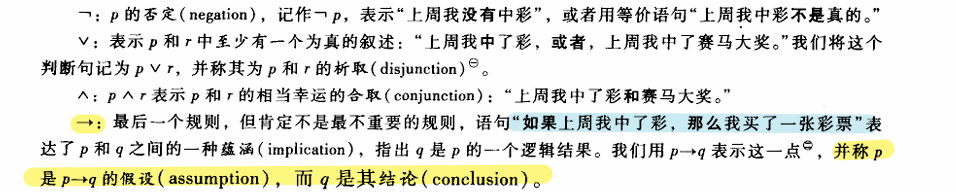

**4个基本的逻辑连接词：¬ ∨ ∧ ->**

约定：

优先级：

1. ¬ 大于 ∨ ∧ 大于 ->
2. 蕴含 -> 是右结合的。

逻辑等价（6个逻辑等价式）【存疑?】

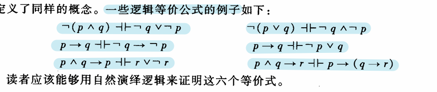


1.2 自然演绎

1.2.1 自然演绎规则

- 合取规则：合取引入、合取消去
- 双重否定规则
- 蕴含消去规则：【最著名的分离规则】、
- 蕴含引入规则
- 析取规则
- 否定规则


1.2.2 派生规则

- 反证规则（PBC）：推出矛盾，说明前提不成立
- 排中律（LEM）：如果 φ∨¬φ 是真的，那么无论 φ 是什么，它一定是真的。


1.2.3 自然演绎总结：

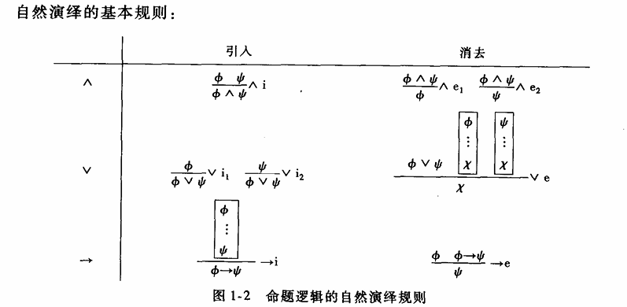

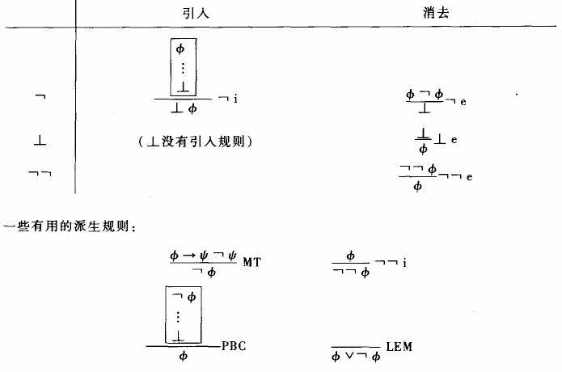


1.2.4 逻辑等价

定义：

>  逻辑命题之间的逻辑等价

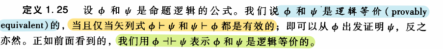


1.3 形式化定义命题逻辑

*被严格定义的字符串公式，这样的公式成为合式公式（well-formed）。*

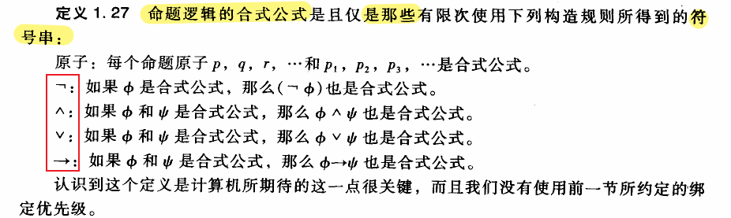

根据BNF（一种定义语法的范式，可以理解成一种规定），可以把命题逻辑的定义更加紧凑地写为：


`::=` 的右边表示一个合式公式。

定义就是用来规定哪些公式属于命题逻辑，哪些不是的。那么怎样判断一个公式是否是合式呢？方法是对公式画一棵语法分析树。


语法分析树【重要！】

如何构造一棵合式公式的语法分析树？

举例：一个公式 φ：

它的语法分析树为：

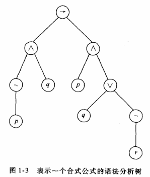

- 如果树的所有叶子都是原子命题，且所有分支结点都是逻辑连接词，那么它对应的公式就是一个合式公式。

  

---


# 2 谓词逻辑

谓词逻辑也被称为一阶逻辑。它比命题逻辑更精确。

命题逻辑：处理“否”、“并”、“或”、“如果”

谓词逻辑：处理“存在...”，“所有...”，“在..中”，“只有...”


在谓词逻辑中，我们要先明白 谓词、变量、量词 这些词的含义是什么。

我们来看一个判断语句：“每个学生都比他的某个老师年轻”

- 谓词：S(andy)中的S是一个谓词，S(andy)表示Andy是一个学生
- 变量：变量是一个实际值的占位符。S(x)中，x是一个变量。
- 量词：引入两个量词 ∀（读作：对所有的）和 ∃（读作：存在某个），它们总是紧跟变量出现，比如 ∀x（对所有x）或 ∃z（存在z）

现在我们用完全符号的形式来写上述语句：


事实上，这种代码是对原句的一种表述。上面形式化语言重新翻译过来即：

*对任意x，若x是一个学生，则存在某个y，y是一位老师，使得x比y年轻。*


另一个例子：*不是所有的鸟都可以飞。*


2.2 作为形式语言的谓词逻辑

- 项
- 公式

我们的任务是构建谓词逻辑公式的语法规则。

注意，谓词逻辑公式中涉及两种对象：

1. x、v 这样的变量
2. m(a), g(x, y) 这样的对象

在谓词逻辑中，用来表示对象的表达式称为**项**（term）。

Y(x, m(x)) 是**公式**。


---

2.2.1 项：


2.2.2 公式：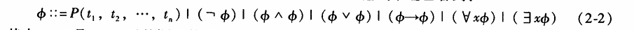

优先级：

- ¬、∀y、∃y 绑定优先级最高
- 其次是∨ ∧ 
- 最后是->，它是右结合的。

谓词逻辑的语法分析树：

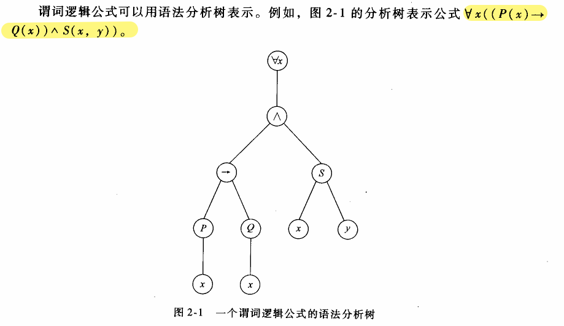

2.2.3 自由/约束变量


2.2.4 代换


2.3 谓词逻辑的证明

- 相等的证明规则

- 全称量词的证明规则

  

量词的等价

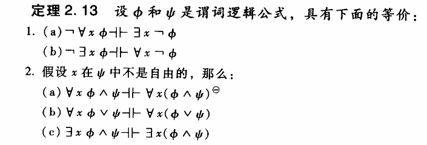

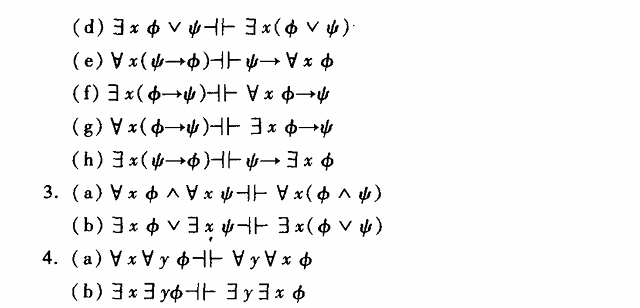


2.7 软件的围观模型

到目前为止，我们的两个中心问题是：

- 模型检测(model checking)：给定谓词逻辑的一个公式φ和一个相匹配的模型M，确定 M|=φ 是否成立
- 语义推导(semantic entailment)：给定谓词逻辑的一个公式集Г，确定 Г|=φ 是否有效


---

# 3 通过模型检测进行验证

3.1 验证的冬季

这一章的重要问题是：**逻辑怎样用来验证程序或系统的正确性。**

形式化验证技术有3部分：

- 描述语言：用于系统建模
- 规范语言：用于描述待验证的形式
- 验证方法：用来确定系统描述是否满足规范、

基于证明进行的验证：系统描述是一组公式Г，而规范是另一个公式φ。验证的方法就是试图找到 Г|-φ 的证明。

基于模型进行验证：系统由逻辑模型M表示。而规范是另一个公式φ。验证方法是由计算模型M是否满足φ构成（写作 M|=φ ）。

我们在本章关注一种叫做模型检测(model checking)的验证方法。根据分类，模型检测是一种自动的、基于模型的、性质验证处理方法。这种方法预期用于并发的、反应式系统。

模型检测基于时态逻辑。时态逻辑的思想是，在一个模型中公式的真与假不是静态的。时态逻辑的模型包含若干状态，一个公式在某些状态下为真，在其他状态下为假。公式可以随系统的状态演化而改变其真值。

在模型检测中，模型M是一个迁移系统（transition systems），而性质φ是时态逻辑公式。为了验证一个系统满足一个性质，我们必须做3件事：

- 用Promela语言对系统进行建模，得到模型M
- 用Promela语言对性质进行编码，产生一个时态逻辑公式φ
- 以M和φ作为输入，运行模型检测器。

这里的Promela语言可以换成满足条件的其他。


- 线性时间逻辑（LTL）把时间看成路径的集合，这里的路径是时间的一个序列。
- 分支时间逻辑（CTL）把时间表示为树，以当前时间为根向未来分叉。


本章我们研究一种时间是线性的逻辑，称为**线性时间逻辑**（Linear-time Temporal Logic，LTL）以及另一种时间是分支的逻辑，即**计算树逻辑**（Computation Tree Logic，CTL）。

模型检测就是对问题 `M,s|=φ` 是否成立计算答案的过程。

这里φ是LTL或CTL中的一个公式，M是系统的一个模型，s是系统的一个状态，|=是满足关系。


## 3.2 线性时间逻辑（LTL）

我们固定一个原子公式集合Atoms（原子公式 p, q, r, ...），它们代表了系统可能成立的原子事实。

### 3.2.1 LTL的语法（p131）

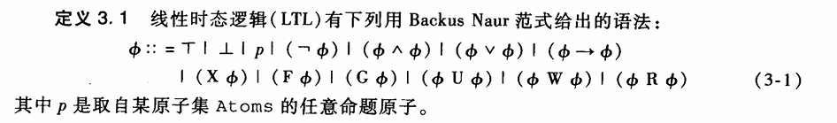

连接词 X, F, G, U, R 和 W 称为时态连接词（temporal connectives）

X - 下一个状态

F - 某个未来状态

G - 所有未来状态

U - 直到

R - 释放

W - 弱一直到

这里是LTL公式的一些例子：

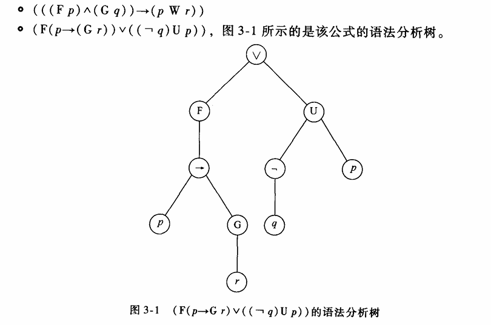


约定3.2 优先级：

- 一元连接词（包括 ¬ 和时态连接词 X, F, G）具有最高绑定级
- 接下来是 U, R, W
- 然后是 ∨ ∧ 
- 最后是 ->，它是右结合的。

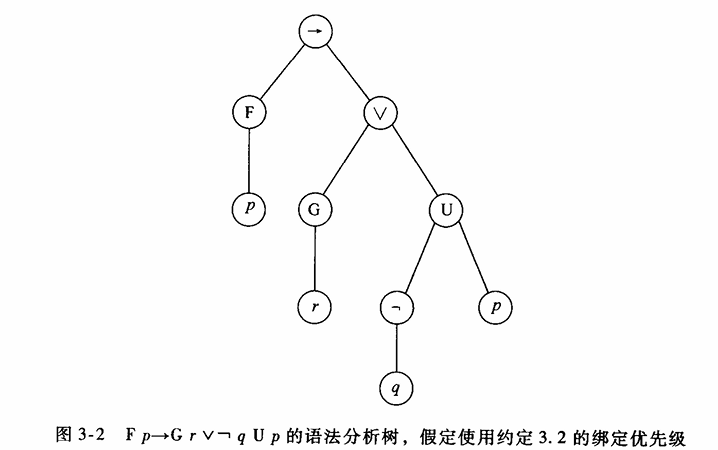

*补充：程序*

**LTL Formulas**

An LTL formula may contain propositional symbols, boolean operators, temporal operators, and parentheses.

- Propositonal Symbols:

  ```
  true, false
  any lowercase string
  ```

- Boolean operators:

  ```
  !   (negation)
  ->  (implication)
  <-> (equivalence)
  &&  (and)
  ||  (or)
  ```

- Temporal operators:

  ```
   G   (always) (Spin syntax : [])
   F   (eventually) (Spin syntax : <>)
   U   (until)
   R   (realease) (Spin syntax : V)
   X   (next)
  ```


3.2.2 LTL语义

定义3.4 迁移系统M

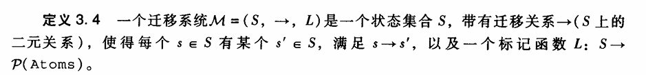

例子：

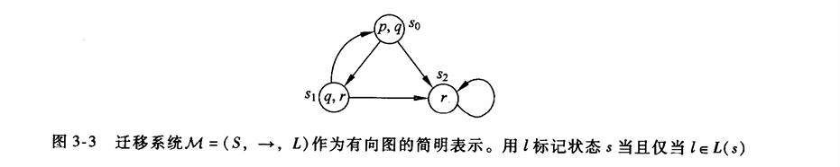

定义3.5 路径

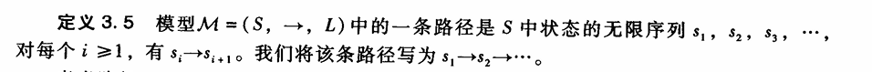

定义3.6 满足关系|=（路径满足一个LTL公式）【重要！】

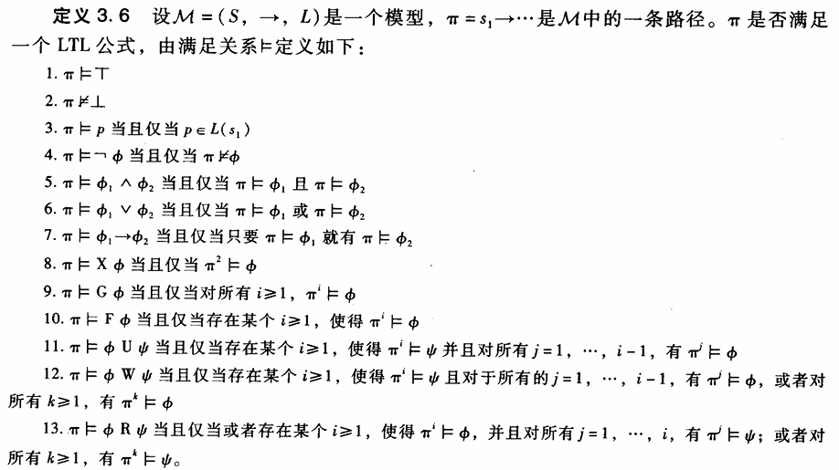

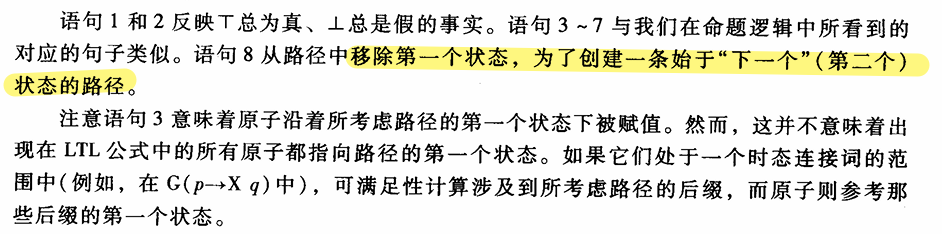

对于U的定义，一定要特别留意！

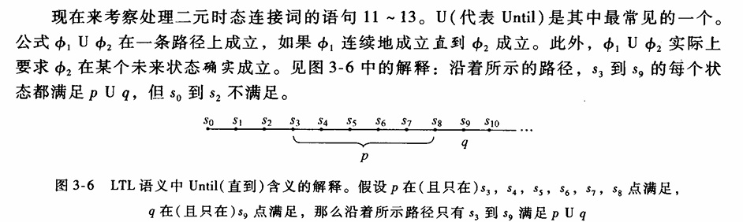

W和R暂时不讨论了。

注意！在语句9~13中，未来包括了当前。这意味着，当我们在说“所有未来状态”时，我们将当前状态作为一种未来状态包括了进来。这样做是一种约定。

定义3.8 `M,s|=φ`            -------->【重要！】


例子：

我们对图3-3的迁移系统做MC：

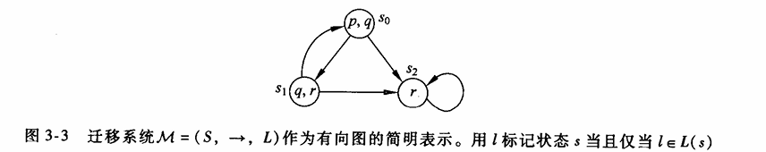

把系统M展开成一棵语法树，如下图所示：

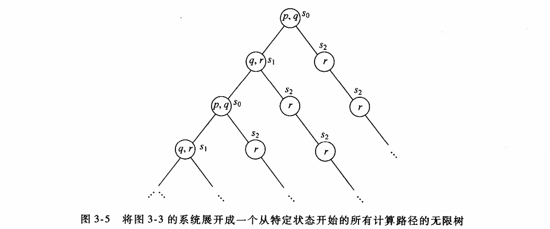

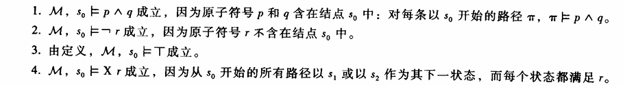

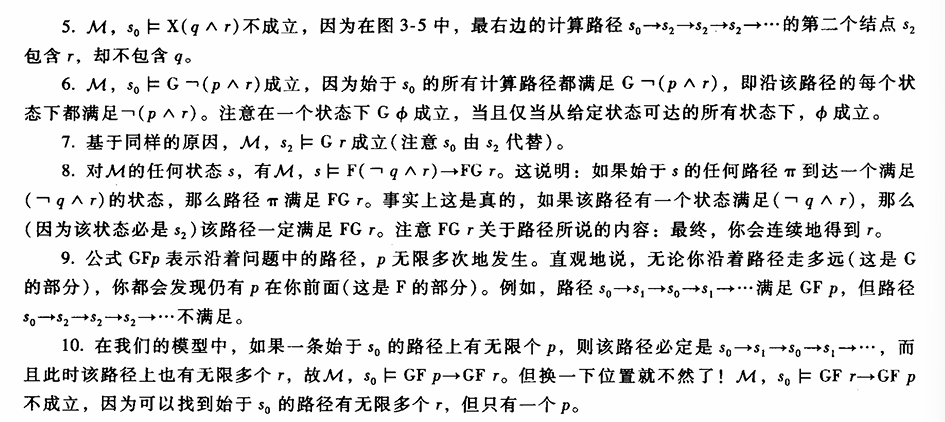


### 3.2.4 LTL公式之间的重要等价

定义3.9 LTL公式之间的等价      -----------> 也许重要，有题型

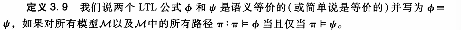

等价意味着他们之间可以互换。

在命题逻辑中，∨ ∧是互相对偶的。


在LTL中，F和G 是互相对偶的，X与其自身对偶：


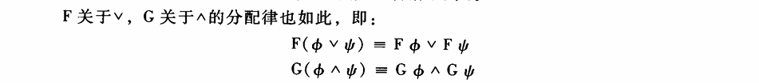

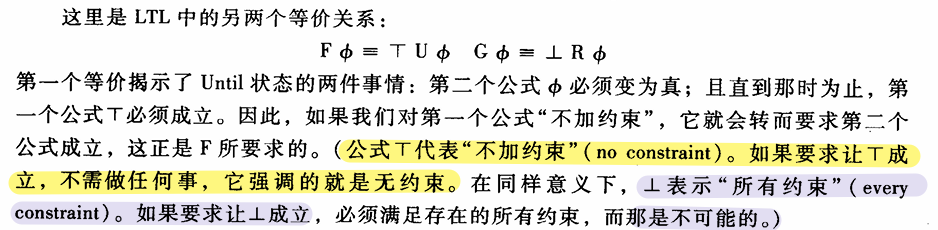


## 3.4 分支时间逻辑（CTL）

在前面各节中对LTL（线性时态逻辑）的分析中，我们注意到LTL公式是在路径上赋值的。**我们定义系统的一个状态满足一个LTL公式，如果由给定状态出发的所有路径都满足它。** 于是，LTL隐含着对所有路径做全称量词限定。因此，断言一条路径存在的性质不能用LTL表达。

分支时间逻辑通过使用**路径变量**解决了这个问题。CTL中，除了有LTL中的时态算子 U, F, G, X外，还有路径量词A和E。分别表达“对所有路径”和“对一条路径”。例如：

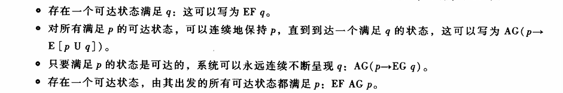

### 3.4.1 CTL的语法 (p152)

定义 3.12 CTL公式的形式化定义

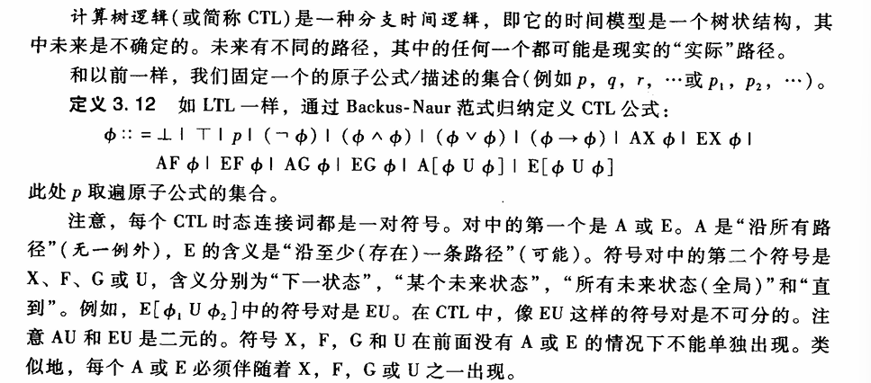

约定 3.13 CTL连接词的优先级

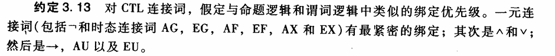

来看看哪些是合法的CTL公式，哪些不是：

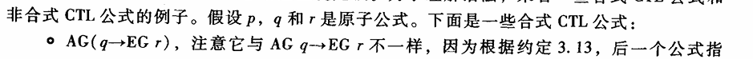

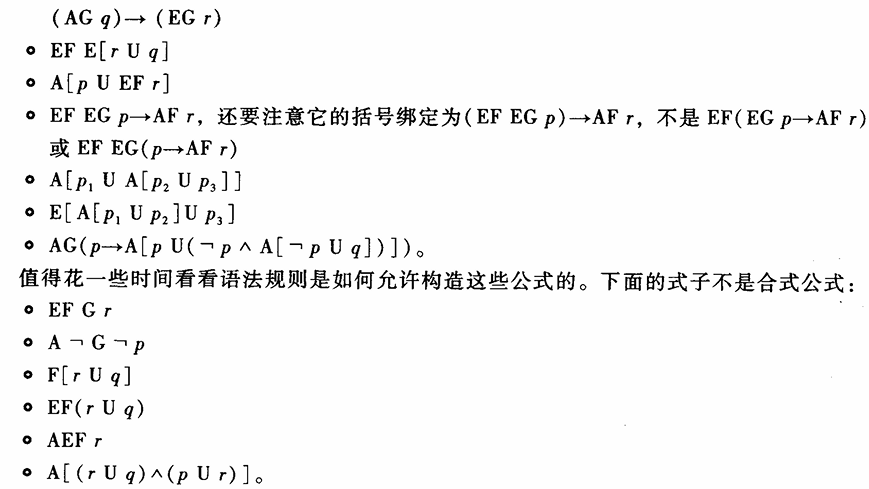

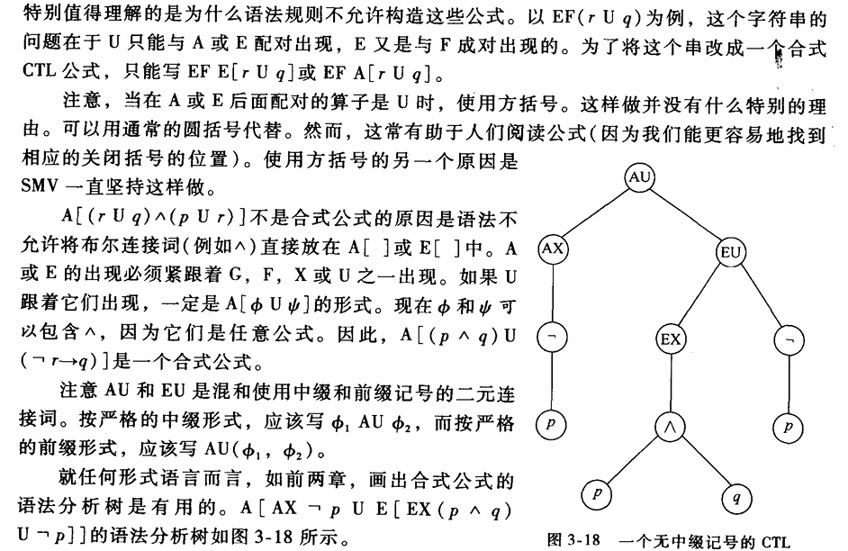

### 3.4.2 计算书逻辑的语义

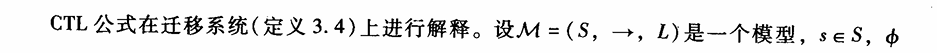

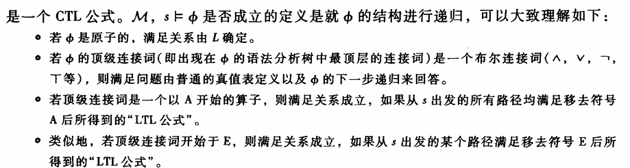

定义3.15 M,s|=φ 的形式定义        ---------> 【重要！】

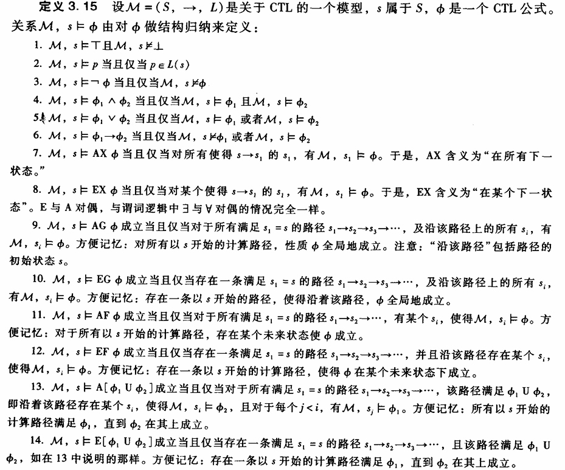

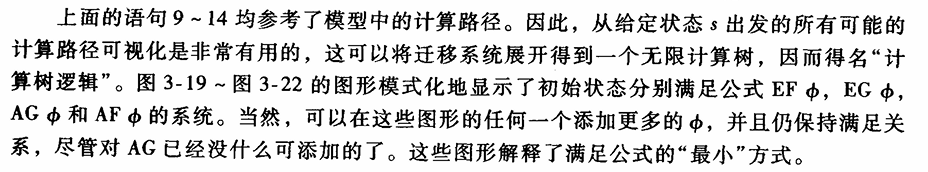

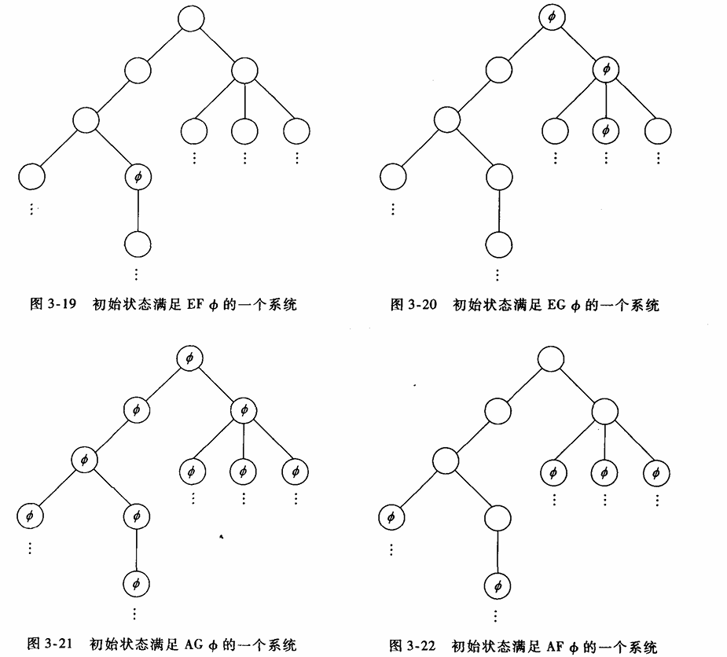

现在来看一个例子，图3-5为例看看这个系统的一些公式检测：


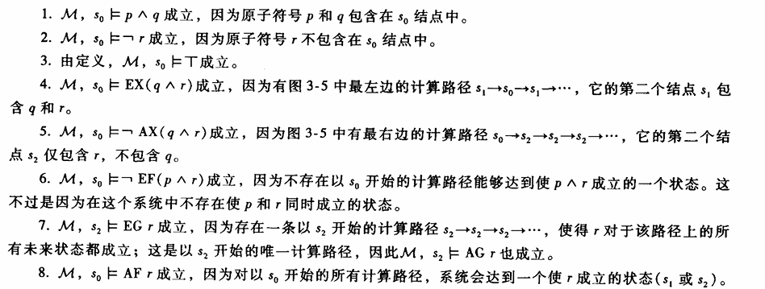

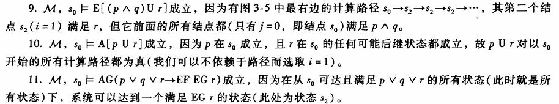

### 3.4.4 CTL公式间的重要等价

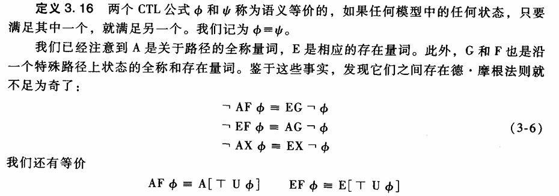

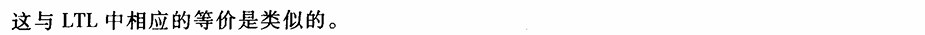

CTL中其他一些值得注意的等价：


### 3.4.5 CTL连接词的适当集

- AU，EU和EX可以形成一个适当集合
- EG，EU，EX也可以形成一个适当集合

定理3.17 CTL中的适当集

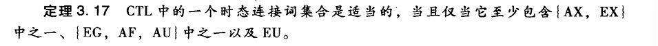


## 3.5 CTL*


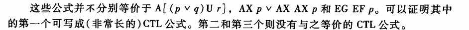

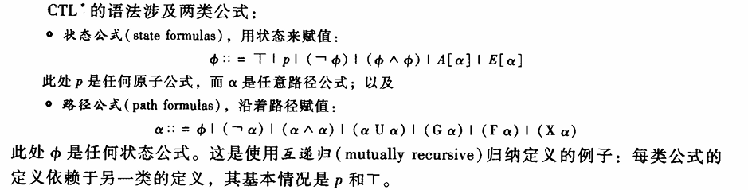


## 3.6 模型检测算法

### 3.6.1 CTL模型检测算法（标记算法）

对一个状态展开成无限树做模型检测更容易，但计算机不能将迁移系统展开成无限树。我们需要对有限的数据进行检测。在φ不满足的情况下，产生一条实际路径，来证明M不能满足φ。

我们把“检测模型M是否满足公式φ”的问题记为：


模型检测机的实现：

1. 可以将模型M，公式φ，状态s0作为输入，然后期待一个“yes”或“no”的输出
2. 可以只输入M和φ，输出是模型M的满足φ的所有状态s

实现2就能实现1，因为只需要判断s0在不在s中就行了。


我们使用【标记算法】来实现模型检测：


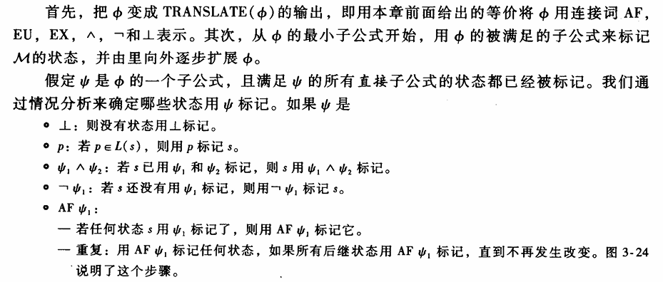

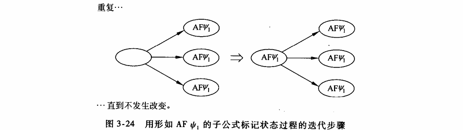

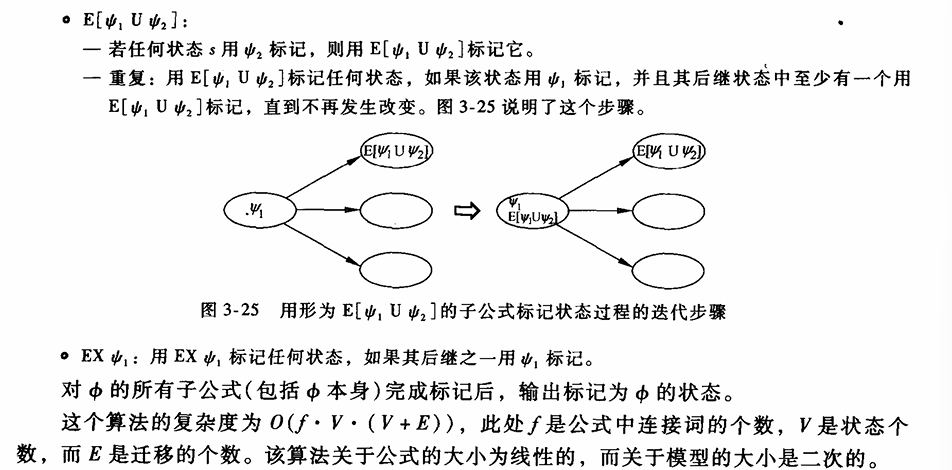


还有别的更有效的方法：直接处理EG、聪明版直接处理EG... 不展开了。


### 3.6.3 LTL模型检测算法（Büchi 自动机）

基本策略

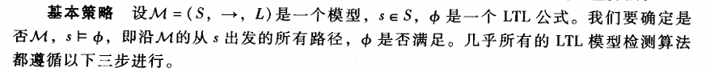

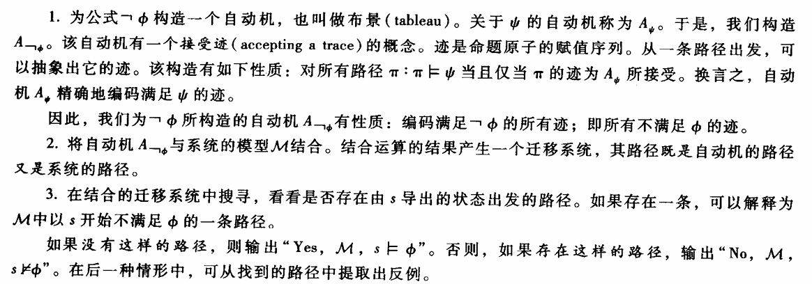

具体需要补充如何构造Buchi自动机


Problem: Does Transition system satisfy LTL formula φ?

In other word we can check: Does Transition system satisfy LTL formula !φ?（这里开始我用!代替¬）

如果找到一条路径满足了!φ，那就能证明模型不满足LTL公式。反之，如果不存在任何一条路径满足!φ，说明模型可以满足公式φ。

所以问题转化为：是否存在一条路径满足LTL公式 !φ？

如何解决？

1. 我们把LTL公式!φ 转化为一个 NBA buchi 自动机 $A_{!φ}$
2. 


---

# 4 程序验证


 


